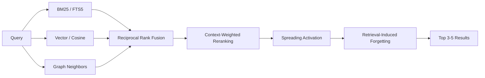
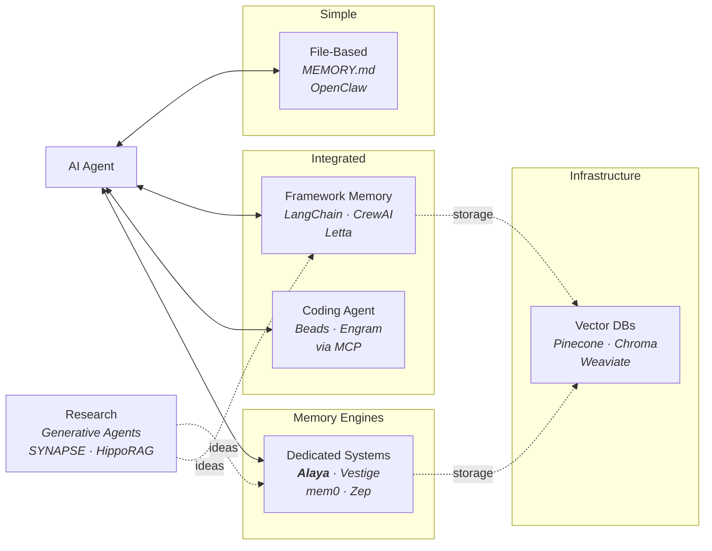

# Alaya

A memory engine for AI agents that remembers, forgets, and learns.

**Alaya** (Sanskrit: *alaya-vijnana*, "storehouse consciousness") is an
embeddable Rust library. One SQLite file. No external services. Your agent
stores conversations, retrieves what matters, and lets the rest fade. The
graph reshapes through use, like biological memory.

```rust
let store = AlayaStore::open("memory.db")?;
store.store_episode(&episode)?;           // store
let results = store.query(&query)?;       // retrieve
store.consolidate(&provider)?;            // distill knowledge
store.forget()?;                          // decay what's stale
```

## The Problem

Most AI agents treat memory as flat files. OpenClaw writes to `MEMORY.md`.
Claudesidian writes to Obsidian. Hand-rolled systems write to JSON or
Markdown. It works at first.

Then the files grow. Context windows fill. The agent dumps everything into
the prompt and hopes the LLM finds what matters.

**The cost is measurable.** OpenClaw injects ~35,600 tokens of workspace
files into every message, 93.5% of which is irrelevant
([#9157](https://github.com/openclaw/openclaw/issues/9157)). Heavy users
report [$3,600/month](https://milvus.io/blog/why-ai-agents-like-openclaw-burn-through-tokens-and-how-to-cut-costs.md)
in token costs. Community tools like
[QMD](https://github.com/tobi/qmd) and
[memsearch](https://github.com/zilliztech/memsearch) cut 70-96% of that
waste by replacing full-context injection with ranked retrieval
([Levine, 2026](https://x.com/andrarchy/status/2015783856087929254)).

**The structure problem compounds the cost.** MEMORY.md conflates decisions,
preferences, and knowledge into one unstructured blob. Users independently
invent [`decision.md`](https://www.chatprd.ai/how-i-ai/jesse-genets-5-openclaw-agents-for-homeschooling-app-building-and-physical-inventories)
files, `working-context.md` snapshots, and
[12-layer memory architectures](https://github.com/coolmanns/openclaw-memory-architecture)
to compensate. Monday you mention "Alice manages the auth team." Wednesday
you ask "who handles auth permissions?" The agent retrieves both memories
by text similarity but cannot connect them
([Chawla, 2026](https://blog.dailydoseofds.com/p/openclaws-memory-is-broken-heres)).

## How Alaya Solves It

| Problem | File-based memory | Alaya |
|---|---|---|
| **Token waste** | Full-context injection (~35K tokens/message) | Ranked retrieval returns only top-k relevant memories |
| **No structure** | Everything in one file (users invent `decision.md` workarounds) | Three typed stores: episodes, knowledge, preferences |
| **No forgetting** | Files grow until you manually curate | Bjork dual-strength decay: weak memories fade, strong ones persist |
| **No associations** | Flat files, no links between memories | Hebbian graph strengthens through co-retrieval; spreading activation finds indirect connections |
| **Brittle preferences** | Agent-authored summary, easily drifts | Preferences emerge from accumulated impressions, crystallize at threshold |
| **LLM required** | Can't function without one | Optional. No embeddings? BM25-only. No LLM? Episodes accumulate. Every feature works independently |

## Getting Started

### Installation

```toml
[dependencies]
alaya = { git = "https://github.com/h4x0r/alaya" }
```

### Quick Start

```rust
use alaya::{AlayaStore, NewEpisode, Role, EpisodeContext, Query, NoOpProvider};

// Open a persistent database (or use open_in_memory() for tests)
let store = AlayaStore::open("memory.db")?;

// Store a conversation episode
store.store_episode(&NewEpisode {
    content: "I've been learning Rust for about six months now".into(),
    role: Role::User,
    session_id: "session-1".into(),
    timestamp: 1740000000,
    context: EpisodeContext::default(),
    embedding: None, // pass Some(vec![...]) if you have embeddings
})?;

// Query with hybrid retrieval (BM25 + vector + graph + RRF)
let results = store.query(&Query::simple("Rust experience"))?;
for mem in &results {
    println!("[{:.2}] {}", mem.score, mem.content);
}

// Get crystallized preferences
let prefs = store.preferences(Some("communication_style"))?;

// Run lifecycle (NoOpProvider works without an LLM)
store.consolidate(&NoOpProvider)?;
store.transform()?;
store.forget()?;
```

### Run the Demo

The demo walks through all six capabilities with annotated output and no
external dependencies:

```bash
git clone https://github.com/h4x0r/alaya.git
cd alaya
cargo run --example demo
```

## Architecture

Alaya is a library, not a framework. Your agent owns the conversation loop,
the LLM, and the embedding model. Alaya owns memory.

```
Your Agent                          Alaya
─────────                           ─────
receive message
  ├── store_episode()           ──▶ episodic store + graph links
  ├── query()                   ──▶ BM25 + vector + graph → RRF → rerank
  ├── preferences()             ──▶ crystallized behavioral patterns
  ├── knowledge()               ──▶ consolidated semantic nodes
  ├── assemble context + prompt
  ├── call LLM
  └── respond

periodic background tasks:
  ├── consolidate(provider)     ──▶ episodes → semantic knowledge
  ├── perfume(interaction, provider) ──▶ impressions → preferences
  ├── transform()               ──▶ dedup, prune, decay
  └── forget()                  ──▶ Bjork strength decay + archival
```

### Three Stores

| Store | Analog | Purpose |
|-------|--------|---------|
| **Episodic** | Hippocampus | Raw conversation events with full context |
| **Semantic** | Neocortex | Distilled knowledge extracted through consolidation |
| **Implicit** | Alaya-vijnana | Preferences and habits that emerge through perfuming |

### Retrieval Pipeline



### Lifecycle Processes

| Process | Inspiration | What it does |
|---------|-------------|--------------|
| **Consolidation** | CLS theory (McClelland et al.) | Distills episodes into semantic knowledge |
| **Perfuming** | Vasana (Yogacara Buddhist psychology) | Accumulates impressions, crystallizes preferences |
| **Transformation** | Asraya-paravrtti | Deduplicates, resolves contradictions, prunes |
| **Forgetting** | Bjork & Bjork (1992) | Decays retrieval strength, archives weak nodes |

## Integration Guide

### Implementing ConsolidationProvider

The `ConsolidationProvider` trait connects Alaya to your LLM for knowledge
extraction:

```rust
use alaya::*;

struct MyProvider { /* your LLM client */ }

impl ConsolidationProvider for MyProvider {
    fn extract_knowledge(&self, episodes: &[Episode]) -> Result<Vec<NewSemanticNode>> {
        // Ask your LLM: "What facts/relationships can you extract?"
        todo!()
    }

    fn extract_impressions(&self, interaction: &Interaction) -> Result<Vec<NewImpression>> {
        // Ask your LLM: "What behavioral signals does this contain?"
        todo!()
    }

    fn detect_contradiction(&self, a: &SemanticNode, b: &SemanticNode) -> Result<bool> {
        // Ask your LLM: "Do these two facts contradict each other?"
        todo!()
    }
}
```

Use `NoOpProvider` without an LLM. Episodes accumulate and BM25 retrieval
works without consolidation.

### Lifecycle Scheduling

| Method | When to call | What it does |
|--------|-------------|--------------|
| `consolidate()` | After accumulating 10+ episodes | Extracts semantic knowledge from episodes |
| `perfume()` | On every user interaction | Extracts behavioral impressions, crystallizes preferences |
| `transform()` | Daily or weekly | Deduplicates, prunes weak links, decays stale preferences |
| `forget()` | Daily or weekly | Decays retrieval strength, archives truly forgotten nodes |

## API Reference

```rust
impl AlayaStore {
    // Open / create
    pub fn open(path: impl AsRef<Path>) -> Result<Self>;
    pub fn open_in_memory() -> Result<Self>;

    // Write
    pub fn store_episode(&self, episode: &NewEpisode) -> Result<EpisodeId>;

    // Read
    pub fn query(&self, q: &Query) -> Result<Vec<ScoredMemory>>;
    pub fn preferences(&self, domain: Option<&str>) -> Result<Vec<Preference>>;
    pub fn knowledge(&self, filter: Option<KnowledgeFilter>) -> Result<Vec<SemanticNode>>;
    pub fn neighbors(&self, node: NodeRef, depth: u32) -> Result<Vec<(NodeRef, f32)>>;

    // Lifecycle
    pub fn consolidate(&self, provider: &dyn ConsolidationProvider) -> Result<ConsolidationReport>;
    pub fn perfume(&self, interaction: &Interaction, provider: &dyn ConsolidationProvider) -> Result<PerfumingReport>;
    pub fn transform(&self) -> Result<TransformationReport>;
    pub fn forget(&self) -> Result<ForgettingReport>;

    // Admin
    pub fn status(&self) -> Result<MemoryStatus>;
    pub fn purge(&self, filter: PurgeFilter) -> Result<PurgeReport>;
}
```

## Design Principles

1. **Memory is a process, not a database.** Every retrieval changes what is
   remembered. The graph reshapes through use.

2. **Forgetting is a feature.** Strategic decay and suppression improve
   retrieval quality over time.

3. **Preferences emerge, they are not declared.** Behavioral patterns
   crystallize from accumulated observations.

4. **The agent owns identity.** Alaya stores seeds. The agent decides which
   seeds matter and how to present them.

5. **Graceful degradation.** No embeddings? BM25-only. No LLM? Episodes
   accumulate. Every feature works independently.

## Research Foundations

Architecture grounded in neuroscience, Buddhist psychology, and information
retrieval. For detailed mappings, see
[docs/theoretical-foundations.md](docs/theoretical-foundations.md).

**Neuroscience:** Hebbian LTP/LTD (Hebb 1949, Bliss & Lomo 1973),
Complementary Learning Systems (McClelland et al. 1995), spreading
activation (Collins & Loftus 1975), encoding specificity (Tulving & Thomson
1973), dual-strength forgetting (Bjork & Bjork 1992), retrieval-induced
forgetting (Anderson et al. 1994), working memory limits (Cowan 2001).

**Yogacara Buddhist Psychology:** Alaya-vijnana (storehouse consciousness),
bija (seeds), vasana (perfuming), asraya-paravrtti (transformation),
vijnaptimatrata (perspective-relative memory).

**Information Retrieval:** Reciprocal Rank Fusion (Cormack et al. 2009),
BM25 via FTS5, cosine similarity vector search.

## Comparison with Alternatives



Alaya is a **dedicated memory engine** with lifecycle management, hybrid
retrieval, and graph dynamics. Closest peers: **Vestige** (Rust, FSRS-6,
spreading activation) and **SYNAPSE** (unified episodic-semantic graph,
lateral inhibition).

- [Full comparison: 90+ systems](docs/related-work.md), grounded in the CoALA taxonomy (Sumers et al., 2024)
- [Interactive landscape](https://h4x0r.github.io/alaya/docs/memory-landscape.html) (D3.js force-directed graph)
- [Theoretical foundations](docs/theoretical-foundations.md) (neuroscience and Buddhist psychology)
- [The MEMORY.md problem](docs/related-work.md#the-memorymd-problem-why-file-based-memory-breaks-at-scale) (community workarounds and how Alaya addresses each)

## License

MIT
