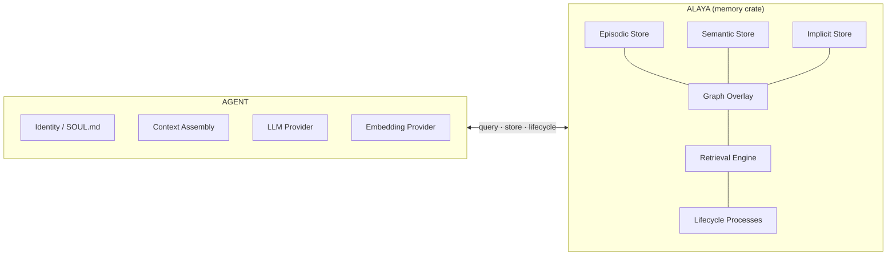
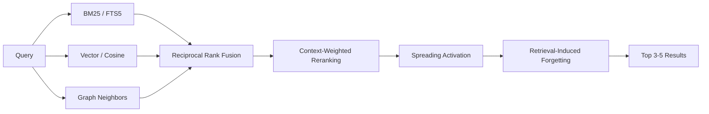

# Alaya

A neuroscience and Buddhist psychology-inspired memory engine for conversational AI agents.

**Alaya** (Sanskrit: *alaya-vijnana*, "storehouse consciousness") is a Rust
library that provides three-tier memory, a Hebbian graph overlay, hybrid
retrieval with spreading activation, and adaptive lifecycle processes. It is
headless and LLM-agnostic — the consuming agent owns identity, embeddings,
and prompt assembly.

## Why Alaya?

Most AI memory systems are Python libraries that require external infrastructure
(Postgres, Neo4j, Redis, Pinecone) and are tightly coupled to specific LLM
providers. Alaya takes a different approach.

**Key differentiators:**

- **Single-file deployment** — one SQLite database, no external services
- **Rust** — embed in any language via FFI, or use natively with zero GC pauses
- **LLM-agnostic** — no hardcoded provider; the agent supplies embeddings and consolidation logic via traits
- **No network calls** — fully local, privacy by architecture
- **Memory as process** — Hebbian graph reshaping, adaptive forgetting, and preference crystallization make memory a living system, not a static store
- **Principled foundations** — architecture grounded in CLS theory, Bjork forgetting, spreading activation, and Yogacara psychology, not ad-hoc heuristics

### Comparison with Alternatives

Systems ordered by adoption. All Python unless noted.

| System | Storage | Infra | LLM | Memory Model | Graph | Retrieval | Forgetting | Preferences |
|--------|---------|:-----:|:---:|-------------|:-----:|-----------|:----------:|:-----------:|
| **Alaya** (Rust) | SQLite single file | None | Optional (traits) | Three-store: episodic, semantic, implicit | Hebbian (reshapes through use) | BM25 + vector + graph + RRF | Bjork dual-strength + RIF | Vasana (emergent) |
| **mem0** | Qdrant/Pinecone + Postgres + Neo4j | 2-3 | Required | Tiered + optional graph | Optional (Mem0g) | Vector + graph | Exponential decay | LLM-extracted |
| **Supermemory** (TS) | KG + vector + graph DB | 2-3 | Required | Graph + vector with decay | Yes | Hybrid vector + graph | Decay curves + expiry | LLM-extracted |
| **Memvid** (Rust) | Single `.mv2` file | None | None (local ONNX) | Append-only Smart Frames | No | Tantivy FTS + HNSW | None (immutable) | No |
| **Zep / Graphiti** | Neo4j + Lucene | 1-2 | Required | Temporal knowledge graph | Static temporal KG | Cosine + BM25 + graph + RRF | Temporal invalidation | Indirect (graph) |
| **Letta (MemGPT)** | Postgres + Chroma/Qdrant | 1-2 | Required (LLM = manager) | OS-inspired: core, recall, archival | No | Agent-driven tool calls | Eviction + summarization | Agent-edited blocks |
| **Cognee** | Neo4j + vectors | 1-2 | Required | Vector + graph knowledge engine | Yes | Hybrid vector + graph | Not documented | Via graph |
| **Hindsight** | Configurable | 1-2 | Required | Four networks: world, experience, opinion, observation | No | Temporal priming + adaptive reasoning | Belief confidence evolution | Opinion memory (novel) |
| **HippoRAG** | In-memory KG | 0 | Required | Hippocampal indexing + open KG | Personalized PageRank | PPR on knowledge graph | No | No |
| **SYNAPSE** | In-memory | 0 | Required | Unified episodic-semantic graph | Spreading activation + lateral inhibition | Activation-based graph traversal | Temporal decay | No |
| **LangMem SDK** | LangGraph store | 0-1 | Required | Semantic + procedural (prompt updates) | No | Vector similarity | No | Via extracted facts |
| **Cortex-Mem** (Rust) | Configurable | 0-1 | Required | Extracted facts with dedup | No | Vector similarity | No | No |
| **A-MEM** | Vector + note graph | 0 | Required | Zettelkasten-inspired linked notes | Implicit links | Embedding + note traversal | Evolution-based | No |
| **MemoryOS** | Configurable | 0-1 | Required | Three-tier OS hierarchy | No | Hierarchical cross-tier | FIFO + paging | Yes |
| **LightMem** | Configurable | 0-1 | Required | Atkinson-Shiffrin: sensory, STM, LTM | No | Topic-grouped | Sleep-time consolidation | No |
| **Mem-alpha** | Configurable | 0-1 | Required | Core + episodic + semantic (RL-managed) | No | RL-learned | RL-learned | No |
| **LangChain** | In-memory / Redis | 0-1 | Optional | Buffer / summary / entity | No | Direct injection | Window / truncation | Minimal |
| **LlamaIndex** | SQLite / Postgres | 0-1 | Optional | Composable blocks | No | Block-dependent | FIFO eviction | Basic (facts) |
| **OpenViking** | VikingDB | 1 | Required | Virtual filesystem: L0, L1, L2 | No | Directory + semantic search | Implicit (tiered) | No |
| **Redis Memory** | Redis + backends | 1+ | Required | Topics + entities + HNSW | No | HNSW vector + topic filter | No | No |
| **Generative Agents** | In-memory | 0 | Required | Stream + reflections + plans | No | Recency x importance x relevance | Recency decay | Emergent |

#### Vector Databases (Infrastructure Layer)

These provide storage and retrieval but not memory semantics (lifecycle,
forgetting, preference learning, graph dynamics).

| System | Language | Hybrid Search | Managed Cloud | Open Source |
|--------|----------|:------------:|:-------------:|:----------:|
| **Pinecone** | Cloud-native | No native BM25 | Yes (only option) | No |
| **ChromaDB** | Python | FTS + vector | Chroma Cloud | Yes |
| **Weaviate** | Go | BM25 + vector | Weaviate Cloud | Yes |
| **Milvus** | Go/C++ | Dense + sparse | Zilliz Cloud | Yes |
| **Cloudflare Vectorize** | Cloud-native | Via Workers AI | Yes (only option) | No |

For a comprehensive analysis grounded in the CoALA taxonomy (Sumers et al.,
2024) and RAG survey literature (Gao et al., 2023; Zhang et al., 2024), see
[docs/related-work.md](docs/related-work.md).

## Architecture



### Three Stores

| Store | Analog | Purpose |
|-------|--------|---------|
| **Episodic** | Hippocampus | Raw conversation events with full context |
| **Semantic** | Neocortex | Distilled knowledge extracted through consolidation |
| **Implicit** | Alaya-vijnana | Preferences and habits that emerge through perfuming |

### Graph Overlay

A Hebbian weighted directed graph spans all three stores. Links strengthen on
co-retrieval (LTP) and weaken through disuse (LTD), naturally developing
small-world topology.

### Retrieval Pipeline



### Lifecycle Processes

| Process | Inspiration | What it does |
|---------|-------------|--------------|
| **Consolidation** | CLS theory (McClelland et al.) | Distills episodes into semantic knowledge |
| **Perfuming** | Vasana (Yogacara Buddhist psychology) | Accumulates impressions, crystallizes preferences |
| **Transformation** | Asraya-paravrtti | Deduplicates, resolves contradictions, prunes |
| **Forgetting** | Bjork & Bjork (1992) | Decays retrieval strength, archives weak nodes |

## Quick Start

```rust
use alaya::{AlayaStore, NewEpisode, Role, EpisodeContext, Query, NoOpProvider};

// Open a persistent database
let store = AlayaStore::open("memory.db")?;

// Store a conversation episode
store.store_episode(&NewEpisode {
    content: "I've been learning Rust for about six months now".into(),
    role: Role::User,
    session_id: "session-1".into(),
    timestamp: 1740000000,
    context: EpisodeContext::default(),
    embedding: None, // pass Some(vec![...]) if you have embeddings
})?;

// Query with hybrid retrieval
let results = store.query(&Query::simple("Rust experience"))?;
for mem in &results {
    println!("[{:.2}] {}", mem.score, mem.content);
}

// Get crystallized preferences
let prefs = store.preferences(Some("communication_style"))?;

// Run lifecycle with a no-op provider (or implement ConsolidationProvider)
let noop = NoOpProvider;
store.consolidate(&noop)?;
store.transform()?;
store.forget()?;
```

## Research Foundations

### Neuroscience

- **Hebbian LTP/LTD** — synapses strengthen on co-activation (Hebb 1949, Bliss & Lomo 1973)
- **Complementary Learning Systems** — fast hippocampus + slow neocortex (McClelland et al. 1995)
- **Spreading Activation** — associative retrieval beyond embedding similarity (Collins & Loftus 1975)
- **Encoding Specificity** — context-dependent retrieval (Tulving & Thomson 1973)
- **Dual-Strength Forgetting** — storage vs retrieval strength (Bjork & Bjork 1992)
- **Retrieval-Induced Forgetting** — retrieving some memories suppresses competitors (Anderson et al. 1994)
- **Working Memory Limits** — 4 +/- 1 chunks (Cowan 2001)

### Yogacara Buddhist psychology

- **Alaya-vijnana** — the storehouse consciousness, persistent substrate for all seeds
- **Bija (seeds)** — living potentials that ripen when conditions align
- **Vasana (perfuming)** — gradual accumulation of impressions that shape behavior
- **Asraya-paravrtti** — periodic transformation toward clarity
- **Vijnaptimatrata** — memory is perspective-relative, not objective

### Information Retrieval

- **Reciprocal Rank Fusion** — merging multiple ranked result sets (Cormack et al. 2009)
- **BM25 via FTS5** — keyword matching with relevance scoring
- **Cosine Similarity** — semantic vector search

## Design Principles

1. **Memory is a process, not a database.** Every retrieval changes what is
   remembered. The graph reshapes through use.

2. **Forgetting is a feature.** Strategic decay and suppression improve
   retrieval quality over time.

3. **Preferences emerge, they are not declared.** The vasana/perfuming model
   lets behavioral patterns crystallize from accumulated observations.

4. **The agent owns identity.** Alaya stores seeds. The agent decides which
   seeds matter and how to present them.

5. **Graceful degradation.** No embeddings? BM25-only. No LLM for
   consolidation? Episodes accumulate. Every feature works independently.

## API Overview

```rust
impl AlayaStore {
    // Write
    pub fn store_episode(&self, episode: &NewEpisode) -> Result<EpisodeId>;

    // Read
    pub fn query(&self, q: &Query) -> Result<Vec<ScoredMemory>>;
    pub fn preferences(&self, domain: Option<&str>) -> Result<Vec<Preference>>;
    pub fn knowledge(&self, filter: Option<KnowledgeFilter>) -> Result<Vec<SemanticNode>>;
    pub fn neighbors(&self, node: NodeRef, depth: u32) -> Result<Vec<(NodeRef, f32)>>;

    // Lifecycle
    pub fn consolidate(&self, provider: &dyn ConsolidationProvider) -> Result<ConsolidationReport>;
    pub fn perfume(&self, interaction: &Interaction, provider: &dyn ConsolidationProvider) -> Result<PerfumingReport>;
    pub fn transform(&self) -> Result<TransformationReport>;
    pub fn forget(&self) -> Result<ForgettingReport>;

    // Admin
    pub fn status(&self) -> Result<MemoryStatus>;
    pub fn purge(&self, filter: PurgeFilter) -> Result<PurgeReport>;
}
```

## License

MIT
