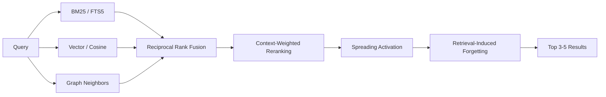
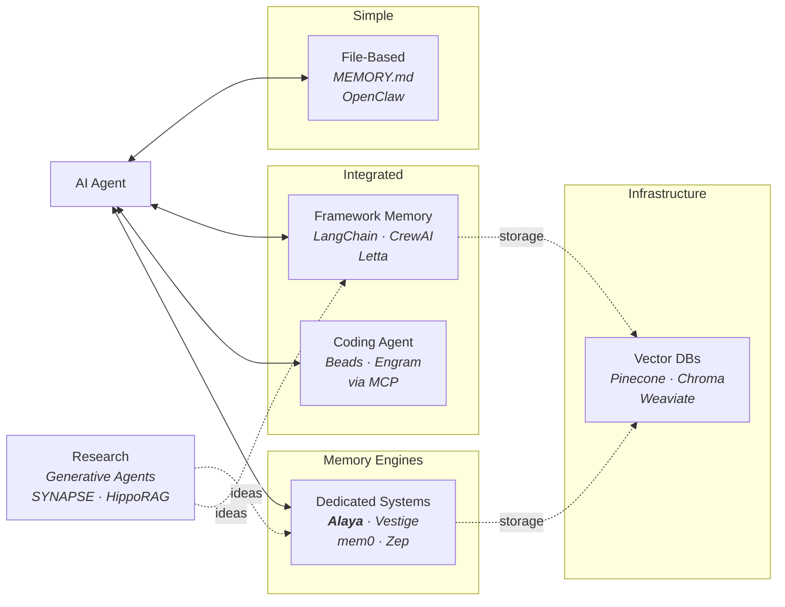

# Alaya

[](https://crates.io/crates/alaya)
[](https://docs.rs/alaya)
[](https://github.com/SecurityRonin/alaya/actions)
[](https://opensource.org/licenses/MIT)
[](https://www.rust-lang.org/)
[](https://modelcontextprotocol.io/)
[](https://github.com/SecurityRonin/alaya)

A memory engine for AI agents that remembers, forgets, and learns.

**Alaya** (Sanskrit: *alaya-vijnana*, "storehouse consciousness") is an
embeddable Rust library. One SQLite file. No external services. Your agent
stores conversations, retrieves what matters, and lets the rest fade. The
graph reshapes through use, like biological memory.

```rust
let store = AlayaStore::open("memory.db")?;
store.store_episode(&episode)?;           // store
let results = store.query(&query)?;       // retrieve
store.consolidate(&provider)?;            // distill knowledge
store.transform()?;                       // discover categories, dedup
store.forget()?;                          // decay what's stale
let cats = store.categories(None)?;       // emergent ontology
```

## The Problem

Most AI agents treat memory as flat files. OpenClaw writes to `MEMORY.md`.
Claudesidian writes to Obsidian. Hand-rolled systems write to JSON or
Markdown. It works at first.

Then the files grow. Context windows fill. The agent dumps everything into
the prompt and hopes the LLM finds what matters.

**The cost is measurable.** OpenClaw injects ~35,600 tokens of workspace
files into every message, 93.5% of which is irrelevant
([#9157](https://github.com/openclaw/openclaw/issues/9157)). Heavy users
report [$3,600/month](https://milvus.io/blog/why-ai-agents-like-openclaw-burn-through-tokens-and-how-to-cut-costs.md)
in token costs. Community tools like
[QMD](https://github.com/tobi/qmd) and
[memsearch](https://github.com/zilliztech/memsearch) cut 70-96% of that
waste by replacing full-context injection with ranked retrieval
([Levine, 2026](https://x.com/andrarchy/status/2015783856087929254)).

**The structure problem compounds the cost.** MEMORY.md conflates decisions,
preferences, and knowledge into one unstructured blob. Users independently
invent [`decision.md`](https://www.chatprd.ai/how-i-ai/jesse-genets-5-openclaw-agents-for-homeschooling-app-building-and-physical-inventories)
files, `working-context.md` snapshots, and
[12-layer memory architectures](https://github.com/coolmanns/openclaw-memory-architecture)
to compensate. Monday you mention "Alice manages the auth team." Wednesday
you ask "who handles auth permissions?" The agent retrieves both memories
by text similarity but cannot connect them
([Chawla, 2026](https://blog.dailydoseofds.com/p/openclaws-memory-is-broken-heres)).

## How Alaya Solves It

| Problem | File-based memory | Alaya |
|---|---|---|
| **Token waste** | Full-context injection (~35K tokens/message) | Ranked retrieval returns only top-k relevant memories |
| **No structure** | Everything in one file (users invent `decision.md` workarounds) | Three typed stores: episodes, knowledge, preferences |
| **No forgetting** | Files grow until you manually curate | Bjork dual-strength decay: weak memories fade, strong ones persist |
| **No associations** | Flat files, no links between memories | Hebbian graph strengthens through co-retrieval; spreading activation finds indirect connections |
| **Brittle preferences** | Agent-authored summary, easily drifts | Preferences emerge from accumulated impressions, crystallize at threshold |
| **LLM required** | Can't function without one | Optional. No embeddings? BM25-only. No LLM? Episodes accumulate. Every feature works independently |

## Getting Started

### MCP Server (recommended for agents)

The fastest way to add Alaya memory to any MCP-compatible agent (Claude Desktop,
OpenClaw, Cline, etc.):

```bash
# Build the MCP server
git clone https://github.com/SecurityRonin/alaya.git
cd alaya
cargo build --release --features mcp
```

Add to your agent's MCP config (e.g. `claude_desktop_config.json`):

```json
{
  "mcpServers": {
    "alaya": {
      "command": "/path/to/alaya/target/release/alaya-mcp"
    }
  }
}
```

That's it. Your agent now has 7 memory tools:

| Tool | What it does |
|------|-------------|
| `remember` | Store a conversation message |
| `recall` | Search memory with hybrid retrieval |
| `status` | Get memory statistics |
| `preferences` | Get learned user preferences |
| `knowledge` | Get distilled semantic facts |
| `maintain` | Run memory cleanup (dedup, decay) |
| `purge` | Delete memories by session, age, or all |

Data is stored in `~/.alaya/memory.db` (override with `ALAYA_DB` env var).
Single SQLite file, no external services.

**Example interaction** — what your agent sees when using Alaya:

```
Agent: [calls remember(content="User prefers dark mode", role="user", session_id="s1")]
Alaya: Stored episode 1 in session 's1'

Agent: [calls recall(query="user preferences")]
Alaya: Found 1 memories:
  1. [user] (score: 0.847) User prefers dark mode

Agent: [calls status()]
Alaya: Memory Status:
  Episodes: 1
  Semantic nodes: 0
  Preferences: 0
```

**Environment variables:**

| Variable | Default | Description |
|----------|---------|-------------|
| `ALAYA_DB` | `~/.alaya/memory.db` | Path to SQLite database |

### Rust Library

For embedding Alaya directly into a Rust application:

```toml
[dependencies]
alaya = "0.1.0"
```

### Quick Start (Rust)

```rust
use alaya::{AlayaStore, NewEpisode, Role, EpisodeContext, Query, NoOpProvider};

// Open a persistent database (or use open_in_memory() for tests)
let store = AlayaStore::open("memory.db")?;

// Store a conversation episode
store.store_episode(&NewEpisode {
    content: "I've been learning Rust for about six months now".into(),
    role: Role::User,
    session_id: "session-1".into(),
    timestamp: 1740000000,
    context: EpisodeContext::default(),
    embedding: None, // pass Some(vec![...]) if you have embeddings
})?;

// Query with hybrid retrieval (BM25 + vector + graph + RRF)
let results = store.query(&Query::simple("Rust experience"))?;
for mem in &results {
    println!("[{:.2}] {}", mem.score, mem.content);
}

// Get crystallized preferences
let prefs = store.preferences(Some("communication_style"))?;

// Run lifecycle (NoOpProvider works without an LLM)
store.consolidate(&NoOpProvider)?;
store.transform()?;
store.forget()?;
```

### Run the Demo

The demo walks through all six capabilities with annotated output and no
external dependencies:

```bash
git clone https://github.com/SecurityRonin/alaya.git
cd alaya
cargo run --example demo
```

## Architecture

Alaya is a library, not a framework. Your agent owns the conversation loop,
the LLM, and the embedding model. Alaya owns memory.

```
Your Agent                          Alaya
─────────                           ─────

Via MCP (stdio):                    alaya-mcp binary
  remember(content, role, session)    ──▶ episodic store + graph links
  recall(query)                       ──▶ BM25 + vector + graph → RRF → rerank
  preferences(domain?)                ──▶ crystallized behavioral patterns
  knowledge(type?, confidence?)       ──▶ consolidated semantic nodes
  maintain()                          ──▶ dedup + decay
  purge(scope)                        ──▶ selective or full deletion

Via Rust library:                   AlayaStore struct
  store_episode()                     ──▶ episodic store + graph links
  query()                            ──▶ BM25 + vector + graph → RRF → rerank
  preferences()                      ──▶ crystallized behavioral patterns
  knowledge()                        ──▶ consolidated semantic nodes
  consolidate(provider)              ──▶ episodes → semantic knowledge
  perfume(interaction, provider)     ──▶ impressions → preferences
  transform()                        ──▶ dedup, prune, decay
  forget()                           ──▶ Bjork strength decay + archival
```

### Three Stores

| Store | Analog | Purpose |
|-------|--------|---------|
| **Episodic** | Hippocampus | Raw conversation events with full context |
| **Semantic** | Neocortex | Distilled knowledge extracted through consolidation |
| **Implicit** | Alaya-vijnana | Preferences and habits that emerge through perfuming |

### Retrieval Pipeline



### Lifecycle Processes

| Process | Inspiration | What it does |
|---------|-------------|--------------|
| **Consolidation** | CLS theory (McClelland et al.) | Distills episodes into semantic knowledge |
| **Perfuming** | Vasana (Yogacara Buddhist psychology) | Accumulates impressions, crystallizes preferences |
| **Transformation** | Asraya-paravrtti | Deduplicates, resolves contradictions, prunes |
| **Forgetting** | Bjork & Bjork (1992) | Decays retrieval strength, archives weak nodes |
| **Emergent Ontology** | Vikalpa (conceptual construction) | Categories emerge from semantic node clustering |

## Integration Guide

### Implementing ConsolidationProvider

The `ConsolidationProvider` trait connects Alaya to your LLM for knowledge
extraction:

```rust
use alaya::*;

struct MyProvider { /* your LLM client */ }

impl ConsolidationProvider for MyProvider {
    fn extract_knowledge(&self, episodes: &[Episode]) -> Result<Vec<NewSemanticNode>> {
        // Ask your LLM: "What facts/relationships can you extract?"
        todo!()
    }

    fn extract_impressions(&self, interaction: &Interaction) -> Result<Vec<NewImpression>> {
        // Ask your LLM: "What behavioral signals does this contain?"
        todo!()
    }

    fn detect_contradiction(&self, a: &SemanticNode, b: &SemanticNode) -> Result<bool> {
        // Ask your LLM: "Do these two facts contradict each other?"
        todo!()
    }
}
```

Use `NoOpProvider` without an LLM. Episodes accumulate and BM25 retrieval
works without consolidation.

### Lifecycle Scheduling

| Method | When to call | What it does |
|--------|-------------|--------------|
| `consolidate()` | After accumulating 10+ episodes | Extracts semantic knowledge from episodes |
| `perfume()` | On every user interaction | Extracts behavioral impressions, crystallizes preferences |
| `transform()` | Daily or weekly | Deduplicates, prunes weak links, decays stale preferences |
| `forget()` | Daily or weekly | Decays retrieval strength, archives truly forgotten nodes |

## API Reference

```rust
impl AlayaStore {
    // Open / create
    pub fn open(path: impl AsRef<Path>) -> Result<Self>;
    pub fn open_in_memory() -> Result<Self>;

    // Write
    pub fn store_episode(&self, episode: &NewEpisode) -> Result<EpisodeId>;

    // Read
    pub fn query(&self, q: &Query) -> Result<Vec<ScoredMemory>>;
    pub fn preferences(&self, domain: Option<&str>) -> Result<Vec<Preference>>;
    pub fn knowledge(&self, filter: Option<KnowledgeFilter>) -> Result<Vec<SemanticNode>>;
    pub fn neighbors(&self, node: NodeRef, depth: u32) -> Result<Vec<(NodeRef, f32)>>;
    pub fn categories(&self, min_stability: Option<f32>) -> Result<Vec<Category>>;
    pub fn node_category(&self, node_id: NodeId) -> Result<Option<Category>>;

    // Lifecycle
    pub fn consolidate(&self, provider: &dyn ConsolidationProvider) -> Result<ConsolidationReport>;
    pub fn perfume(&self, interaction: &Interaction, provider: &dyn ConsolidationProvider) -> Result<PerfumingReport>;
    pub fn transform(&self) -> Result<TransformationReport>;
    pub fn forget(&self) -> Result<ForgettingReport>;

    // Admin
    pub fn status(&self) -> Result<MemoryStatus>;
    pub fn purge(&self, filter: PurgeFilter) -> Result<PurgeReport>;
}
```

## Design Principles

1. **Memory is a process, not a database.** Every retrieval changes what is
   remembered. The graph reshapes through use.

2. **Forgetting is a feature.** Strategic decay and suppression improve
   retrieval quality over time.

3. **Preferences emerge, they are not declared.** Behavioral patterns
   crystallize from accumulated observations.

4. **The agent owns identity.** Alaya stores seeds. The agent decides which
   seeds matter and how to present them.

5. **Graceful degradation.** No embeddings? BM25-only. No LLM? Episodes
   accumulate. Every feature works independently.

## Research Foundations

Architecture grounded in neuroscience, Buddhist psychology, and information
retrieval. For detailed mappings, see
[docs/theoretical-foundations.md](docs/theoretical-foundations.md).

**Neuroscience:** Hebbian LTP/LTD (Hebb 1949, Bliss & Lomo 1973),
Complementary Learning Systems (McClelland et al. 1995), spreading
activation (Collins & Loftus 1975), encoding specificity (Tulving & Thomson
1973), dual-strength forgetting (Bjork & Bjork 1992), retrieval-induced
forgetting (Anderson et al. 1994), working memory limits (Cowan 2001).

**Yogacara Buddhist Psychology:** Alaya-vijnana (storehouse consciousness),
bija (seeds), vasana (perfuming), asraya-paravrtti (transformation),
vijnaptimatrata (perspective-relative memory).

**Information Retrieval:** Reciprocal Rank Fusion (Cormack et al. 2009),
BM25 via FTS5, cosine similarity vector search.

## Comparison with Alternatives



Alaya is a **dedicated memory engine** with lifecycle management, hybrid
retrieval, and graph dynamics. Closest peers: **Vestige** (Rust, FSRS-6,
spreading activation) and **SYNAPSE** (unified episodic-semantic graph,
lateral inhibition).

### Why Alaya over...

| Alternative | What it does well | What Alaya adds |
|---|---|---|
| **MEMORY.md** | Zero setup | Ranked retrieval (not full-context injection), typed stores, automatic decay |
| **mem0** | Managed cloud memory with auto-extraction | Local-only (single SQLite file), no API keys, Hebbian graph dynamics |
| **Zep** | Production-ready with cloud/self-hosted options | No external services, association graph, preference crystallization |
| **Vestige** | Rust, FSRS-6 spaced repetition | Three-store architecture, Hebbian co-retrieval, spreading activation |
| **LangChain Memory** | Framework-integrated, many backends | Framework-agnostic, lifecycle management, works without an LLM |

- [Full comparison: 90+ systems](docs/related-work.md), grounded in the CoALA taxonomy (Sumers et al., 2024)
- [Interactive landscape](https://SecurityRonin.github.io/alaya/docs/memory-landscape.html) (D3.js force-directed graph)
- [Theoretical foundations](docs/theoretical-foundations.md) (neuroscience and Buddhist psychology)
- [The MEMORY.md problem](docs/related-work.md#the-memorymd-problem-why-file-based-memory-breaks-at-scale) (community workarounds and how Alaya addresses each)

## v0.1.0 — What's In This Release

- **Three-store architecture** (episodic/semantic/implicit) + Hebbian graph overlay
- **5 lifecycle operations:** consolidate, transform, forget, perfume, emergent ontology
- **Modular RAG retrieval:** BM25 + vector + graph + RRF fusion
- **Bjork dual-strength forgetting** with retrieval-induced suppression
- **Emergent flat categories** via dual-signal clustering (embedding + graph)
- **Zero-dependency Rust library** with SQLite WAL + FTS5
- **181 tests** (154 unit + 9 integration + 18 doc), CI across 3 OS x 2 toolchains
- **MCP server** (optional `mcp` feature flag)

## v0.2.0 Roadmap

- Category hierarchy (*vikalpa*), prototype theory (*nama-rupa*), category seeds (*bija*)
- Conceptual transformation (*asraya-paravrtti*) — categories evolve through use
- Cross-domain bridging via spreading activation through category nodes
- MCP tool extensions (categories, knowledge filter, recall boost)
- EmbeddingProvider trait

## Benchmark Evaluation

We evaluate two canonical baselines — full-context injection and naive
vector RAG — on three benchmarks: LoCoMo (1,540 questions), LongMemEval
(500 questions), and MemoryAgentBench (734 questions across 4
competencies). Generator: Gemini-2.0-Flash-001; Judge: GPT-4o-mini. Full
methodology and statistical analysis:
[docs/benchmark-evaluation.md](docs/benchmark-evaluation.md).


**Key findings:**
- **Retrieval crossover:** Full-context dominates on shorter conversations
  (LoCoMo, 16–26K tokens) but naive RAG wins on longer histories
  (LongMemEval, ~115K tokens). Both differences statistically significant
  (McNemar's test, p < 0.001).
- **Test-time learning gap:** The largest gap across all benchmarks — 86%
  vs 44% (+42pp) — RAG destroys the sequential structure needed for
  in-context learning.
- **Conflict resolution is unsolved:** Both baselines score ~50% on
  contradiction handling, confirming that neither full-context nor
  retrieval provides a mechanism for resolving conflicting information.
- Neither baseline addresses what lifecycle management is designed for.

## Development

```bash
# Run all library tests
cargo test

# Run MCP integration tests
cargo test --features mcp

# Build the MCP server
cargo build --release --features mcp

# Run the demo (no external dependencies)
cargo run --example demo
```

## Support

If Alaya is useful to you, consider supporting development:

[](https://github.com/sponsors/h4x0r)

Star the repo if you find it useful — it helps others discover Alaya.

## License

MIT
