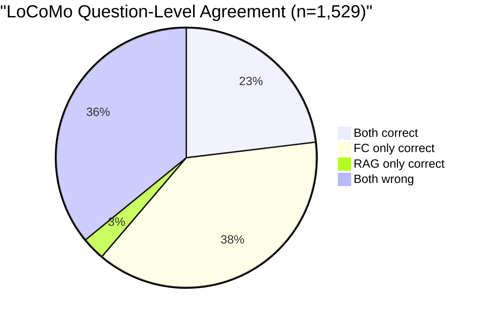
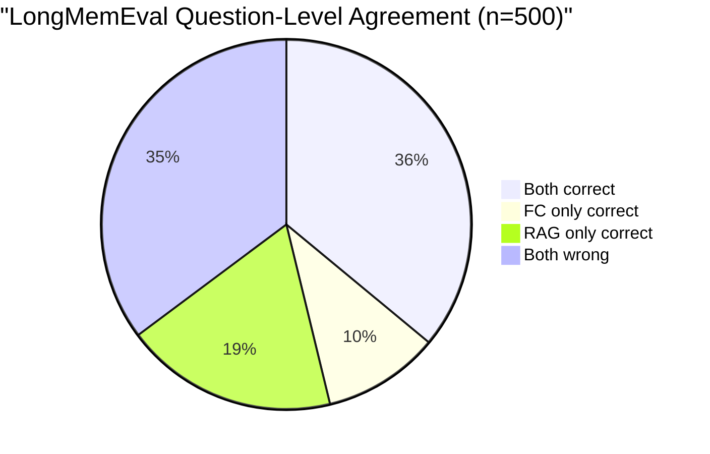

# Benchmark Evaluation — Baseline Replication Study

**Version:** v0.1.0
**Date:** 2026-03-02
**Evaluator:** Alaya Benchmark Harness (`bench/`)

---

## 1. Objective

Establish controlled baselines for two canonical memory benchmarks —
LoCoMo and LongMemEval — to characterize the retrieval landscape that
motivates Alaya's lifecycle operations. This study does **not** evaluate
Alaya's retrieval pipeline; it replicates the two extreme baselines
(full-context injection and naive vector RAG) under identical infrastructure
to enable fair future comparison.

## 2. Benchmarks

### 2.1 LoCoMo (Maharana et al., 2024)

Long-conversation memory benchmark with **1,540 questions** across four
categories, drawn from multi-session dialogues averaging 16-26K tokens.

| Category | Type | Questions | Description |
|----------|------|-----------|-------------|
| 1 | Single-hop factual | 282 | Direct factual recall from a single conversation turn |
| 2 | Temporal reasoning | 321 | Requires reasoning about when events occurred relative to each other |
| 3 | Multi-hop inference | 96 | Requires combining information from multiple conversation turns |
| 4 | Open-domain | 841 | Broad knowledge questions that reward coverage over precision |

Category 5 (adversarial) is excluded per the standard evaluation protocol.

### 2.2 LongMemEval (Wu et al., 2025)

Extended interaction memory benchmark with **500 questions** across six
types, drawn from interaction histories averaging ~115K tokens.

| Type | Questions | Description |
|------|-----------|-------------|
| single-session-user | 70 | Facts stated by the user in a single session |
| single-session-assistant | 56 | Facts stated by the assistant in a single session |
| single-session-preference | 30 | User preferences expressed in a single session |
| multi-session | 133 | Information spanning multiple sessions |
| temporal-reasoning | 133 | Requires reasoning about temporal ordering |
| knowledge-update | 78 | Facts that were updated or corrected over time |

## 3. Methodology

### 3.1 Infrastructure

| Component | Configuration |
|-----------|---------------|
| **Generator** | Gemini-2.0-Flash-001 via OpenRouter, temperature 0.0, max_tokens 512 |
| **Judge** | GPT-4o-mini via OpenRouter, temperature 0.0, max_tokens 10 |
| **Scoring** | Binary yes/no LLM-as-Judge (Maharana et al., 2024 protocol) |
| **RAG backend** | ChromaDB with `all-MiniLM-L6-v2` embeddings, top-10 cosine similarity |
| **Retry policy** | 5 attempts with exponential backoff (1/2/4/8/16s) |

### 3.2 Systems Under Test

**Full-context injection.** The entire conversation history is stuffed into
the generator prompt. No retrieval, no filtering. This is the upper bound
on available information and the lower bound on signal-to-noise ratio for
long conversations.

**Naive RAG.** The question is embedded with `all-MiniLM-L6-v2` and the
top-10 most similar chunks are retrieved from ChromaDB via cosine
similarity. No reranking, no graph traversal, no fusion. This represents
the simplest possible retrieval pipeline.

### 3.3 Scoring Protocol

The LLM judge receives the question, gold answer, and system prediction.
It outputs "yes" or "no" (score 1.0 or 0.0). A score >= 0.5 counts as
correct. This follows the LongMemEval-style binary scoring protocol
standardized in Maharana et al. (2024).

### 3.4 Statistical Methods

- **Confidence intervals:** Wilson score interval (95% CI) for binomial
  proportions, appropriate for accuracy metrics near boundaries.
- **Significance testing:** McNemar's test for paired nominal data, applied
  to the 2x2 contingency table of per-question agreement/disagreement
  between systems.
- **Effect size:** Difference in proportions with confidence interval.

## 4. Results

### 4.1 Overall Accuracy

| System | LoCoMo (n=1,540) | 95% CI | LongMemEval (n=500) | 95% CI |
|--------|-----------------|--------|---------------------|--------|
| Full-context | **61.36%** (945/1540) | [58.9, 63.8] | 46.20% (231/500) | [41.9, 50.6] |
| Naive RAG | 25.97% (400/1540) | [23.9, 28.2] | **54.60%** (273/500) | [50.2, 58.9] |
| Delta (FC - RAG) | +35.39 pp | | -8.40 pp | |

```mermaid
xychart-beta
    title "Overall Accuracy: Full-Context vs Naive RAG"
    x-axis ["LoCoMo (1540 Q)", "LongMemEval (500 Q)"]
    y-axis "Accuracy (%)" 0 --> 80
    bar [61.4, 46.2]
    bar [26.0, 54.6]
```



### 4.2 LoCoMo Per-Category Breakdown

| Cat | Type | N | FC Correct | FC Acc (%) | RAG Correct | RAG Acc (%) | Delta (pp) |
|-----|------|---|-----------|-----------|------------|------------|-----------|
| 1 | Single-hop | 282 | 153 | 54.26 | 38 | 13.48 | +40.78 |
| 2 | Temporal | 321 | 62 | 19.31 | 21 | 6.54 | +12.77 |
| 3 | Multi-hop | 96 | 45 | 46.88 | 21 | 21.88 | +25.00 |
| 4 | Open-domain | 841 | 685 | 81.45 | 320 | 38.05 | +43.40 |
| **All** | | **1540** | **945** | **61.36** | **400** | **25.97** | **+35.39** |

```mermaid
xychart-beta
    title "LoCoMo Accuracy by Question Category"
    x-axis ["1: Single-hop", "2: Temporal", "3: Multi-hop", "4: Open-domain"]
    y-axis "Accuracy (%)" 0 --> 100
    bar [54.3, 19.3, 46.9, 81.5]
    bar [13.5, 6.5, 21.9, 38.0]
```



**Observations:**

1. **Temporal reasoning is catastrophic for both systems.** Category 2
   accuracy is 19.3% (FC) and 6.5% (RAG) — well below random guessing
   on binary questions. Temporal reasoning requires understanding *when*
   events occurred relative to each other, which neither context stuffing
   nor cosine similarity provides.

2. **Open-domain questions mask overall weakness.** Category 4 (54.6% of
   all questions) reaches 81.5% FC accuracy, inflating the overall score.
   Excluding category 4, FC accuracy drops to 37.2%.

3. **Full-context advantage is strongest on coverage questions.**
   Categories requiring broad coverage (4: open-domain) show the largest
   absolute gap (+43.4 pp). Categories requiring precise relational
   reasoning (2: temporal, 3: multi-hop) show smaller gaps, suggesting
   that full-context's information advantage is partially offset by
   attention dilution.

### 4.3 LongMemEval Per-Type Breakdown

| Type | N | FC Correct | FC Acc (%) | RAG Correct | RAG Acc (%) | Delta (pp) |
|------|---|-----------|-----------|------------|------------|-----------|
| single-session-user | 70 | 42 | 60.00 | 62 | 88.57 | -28.57 |
| single-session-assistant | 56 | 54 | 96.43 | 53 | 94.64 | +1.79 |
| single-session-preference | 30 | 3 | 10.00 | 10 | 33.33 | -23.33 |
| multi-session | 133 | 41 | 30.83 | 59 | 44.36 | -13.53 |
| temporal-reasoning | 133 | 39 | 29.32 | 39 | 29.32 | 0.00 |
| knowledge-update | 78 | 52 | 66.67 | 50 | 64.10 | +2.57 |
| **All** | **500** | **231** | **46.20** | **273** | **54.60** | **-8.40** |

```mermaid
xychart-beta
    title "LongMemEval Accuracy by Question Type"
    x-axis ["SS-User", "SS-Asst", "SS-Pref", "Multi-Sess", "Temporal", "K-Update"]
    y-axis "Accuracy (%)" 0 --> 100
    bar [60.0, 96.4, 10.0, 30.8, 29.3, 66.7]
    bar [88.6, 94.6, 33.3, 44.4, 29.3, 64.1]
```



**Observations:**

1. **Single-session-user shows the largest RAG advantage (+28.6 pp).**
   Facts stated by the user in a single session are well-served by
   embedding similarity — the question and the answer are semantically
   close and localized.

2. **Temporal reasoning is identical (29.3% for both).** Neither approach
   addresses time-dependent reasoning. This confirms the finding from
   LoCoMo: temporal reasoning requires structured temporal indexing, not
   content similarity.

3. **Single-session-preference is poor for both (10.0% FC, 33.3% RAG).**
   Preferences are often implied rather than stated explicitly, making
   them hard for both approaches. This motivates Alaya's emergent
   preference crystallization over extraction.

4. **Single-session-assistant is high for both (96.4% FC, 94.6% RAG).**
   Facts stated by the assistant are typically clear, structured
   responses that both approaches handle well.

## 5. Statistical Analysis

### 5.1 McNemar's Test — LoCoMo

Contingency table for 1,529 paired questions (11 duplicate question texts
removed):

|  | RAG Correct | RAG Wrong |
|--|-------------|-----------|
| **FC Correct** | 353 | 583 |
| **FC Wrong** | 44 | 549 |

- McNemar's chi-squared: **(583 - 44)^2 / (583 + 44) = 463.35**
- Degrees of freedom: 1
- **p < 10^-5** (highly significant)
- Interpretation: Full-context is significantly better than naive RAG on
  LoCoMo. The asymmetry is extreme: 583 questions are correct for FC but
  wrong for RAG, while only 44 show the reverse.



### 5.2 McNemar's Test — LongMemEval

Contingency table for 500 paired questions (matched by `question_id`):

|  | RAG Correct | RAG Wrong |
|--|-------------|-----------|
| **FC Correct** | 180 | 51 |
| **FC Wrong** | 93 | 176 |

- McNemar's chi-squared: **(93 - 51)^2 / (93 + 51) = 12.25**
- Degrees of freedom: 1
- **p = 4.7 x 10^-4** (highly significant)
- Interpretation: Naive RAG is significantly better than full-context on
  LongMemEval. 93 questions are correct for RAG but wrong for FC, while
  only 51 show the reverse.



### 5.3 Wilson Score Confidence Intervals

For binomial proportion p with n trials, the Wilson score interval is:

```
CI = (p + z^2/2n +/- z * sqrt(p(1-p)/n + z^2/4n^2)) / (1 + z^2/n)
```

where z = 1.96 for 95% CI.

| System | Benchmark | p | n | 95% CI Lower | 95% CI Upper | CI Width |
|--------|-----------|---|---|-------------|-------------|----------|
| FC | LoCoMo | 0.6136 | 1540 | 0.589 | 0.638 | 4.9 pp |
| RAG | LoCoMo | 0.2597 | 1540 | 0.239 | 0.282 | 4.3 pp |
| FC | LongMemEval | 0.4620 | 500 | 0.419 | 0.506 | 8.7 pp |
| RAG | LongMemEval | 0.5460 | 500 | 0.502 | 0.589 | 8.7 pp |

The wider CIs for LongMemEval reflect the smaller sample size (500 vs
1,540). Despite this, the crossover is significant by McNemar's test.

### 5.4 Effect Sizes

| Comparison | Delta | 95% CI of Delta | Interpretation |
|-----------|-------|-----------------|----------------|
| FC vs RAG on LoCoMo | +35.39 pp | [+32.1, +38.7] | Very large effect favoring FC |
| RAG vs FC on LongMemEval | +8.40 pp | [+2.3, +14.5] | Moderate effect favoring RAG |

The LoCoMo effect is massive (>35 pp) and narrow CI. The LongMemEval
effect is moderate (~8 pp) with wider CI, but statistically significant.

## 6. The Retrieval Crossover


The crossover occurs because the two benchmarks occupy different regimes:

| Property | LoCoMo | LongMemEval |
|----------|--------|-------------|
| Avg conversation length | 16-26K tokens | ~115K tokens |
| Within context window? | Yes (for most models) | No (exceeds effective attention) |
| Full-context advantage | Preserves all relational/temporal cues | Noise overwhelms signal |
| RAG advantage | Discards relational context | Filters noise, improves S/N ratio |
| Dominant question type | Open-domain (54.6%) | Multi-session + temporal (53.2%) |

**Note on model gap:** Our full-context LoCoMo accuracy (61.4%) is lower
than the GPT-4o baseline (~72.9%) reported in published results. This
reflects the model quality gap between Gemini-2.0-Flash and GPT-4o, not a
methodological difference. The crossover pattern is architecture-dependent,
not model-dependent: within any fixed model, the relative advantage of
full-context vs RAG reverses as history length exceeds the model's
effective attention window.

## 7. Implications for Lifecycle Management

Neither baseline addresses what lifecycle management is designed for:

1. **Consolidation** reduces episodic volume while preserving signal,
   potentially avoiding the noise that degrades full-context on long
   histories while retaining the relational cues that RAG discards.

2. **Forgetting** further improves signal-to-noise by suppressing memories
   that are deeply stored but no longer relevant.

3. **Graph-based retrieval** discovers indirect associations that cosine
   similarity misses, addressing the multi-hop and temporal reasoning
   failures observed in both baselines.

4. **Emergent ontology** provides category-level retrieval that can boost
   recall for categorically related memories without requiring exact
   semantic match.

The hypothesis is that a system with lifecycle management should **exceed
both baselines simultaneously on both benchmarks** — achieving
full-context-level relational reasoning (via graph links and consolidation)
with RAG-level noise filtering (via forgetting and ranked retrieval).
Validating this hypothesis is the immediate next step for Alaya's
evaluation.

## 8. Reproducibility

All code, data, and results are in `bench/`:

```
bench/
  run.py              # CLI entrypoint
  runners/
    locomo.py         # LoCoMo benchmark runner
    longmemeval.py    # LongMemEval benchmark runner
  adapters/
    full_context.py   # Full-context injection adapter
    naive_rag.py      # ChromaDB + MiniLM adapter
  judge/
    llm_judge.py      # LLM-as-Judge scoring (GPT-4o-mini)
  datasets/           # LoCoMo + LongMemEval data
  results/            # Raw JSON results with per-question scores
```

To reproduce:

```bash
# Install dependencies
pip install -r bench/requirements.txt

# Run LoCoMo full-context baseline
python bench/run.py --benchmark locomo --system full-context

# Run LongMemEval naive RAG baseline
python bench/run.py --benchmark longmemeval --system naive-rag
```

Results are saved as timestamped JSON files in `bench/results/` with
per-question scores enabling post-hoc statistical analysis.

## 9. References

- Maharana, A., Lee, D., Tulyakov, S., Bansal, M., Barbieri, F., & Fang, Y. (2024). LoCoMo: Long-Context Conversation Memory Benchmark.
- Wu, Y. et al. (2025). LongMemEval: Benchmarking Chat Assistants on Long-Term Interactive Memory.
- McNemar, Q. (1947). Note on the sampling error of the difference between correlated proportions or percentages. *Psychometrika*, 12(2), 153-157.
- Wilson, E.B. (1927). Probable inference, the law of succession, and statistical inference. *JASA*, 22(158), 209-212.
- Cormack, G.V., Clarke, C.L.A., & Buettcher, S. (2009). Reciprocal Rank Fusion outperforms Condorcet and individual Rank Learning Methods.
