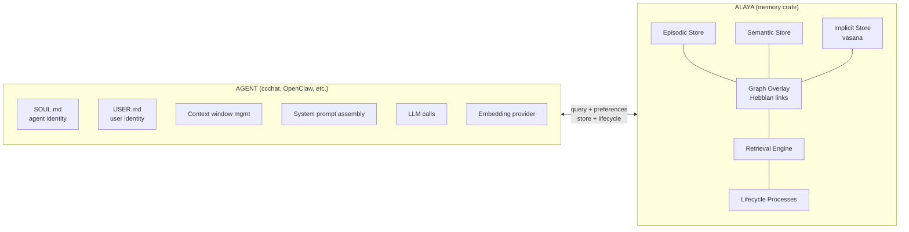
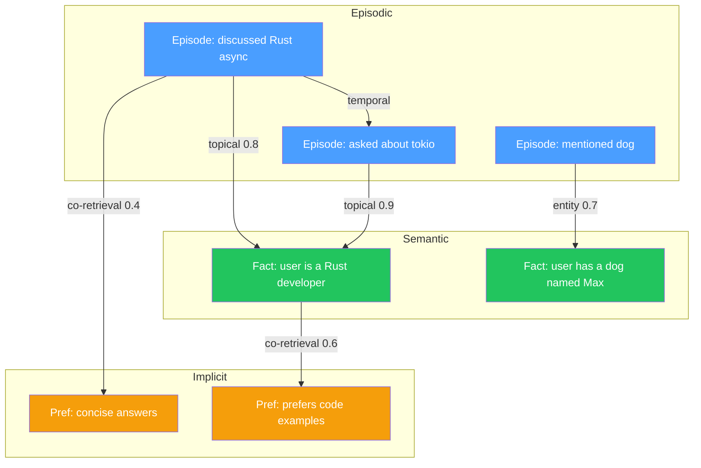
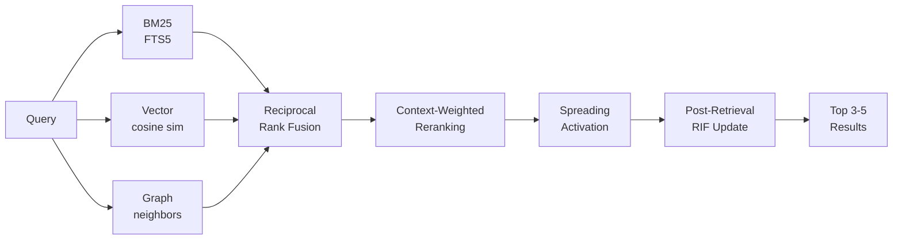
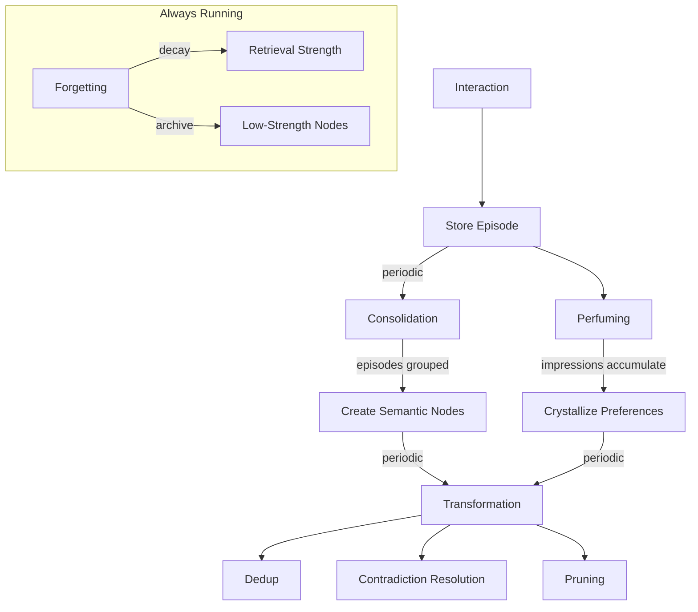

# Alaya: A Neuroscience and Buddhist Psychology-Inspired Memory Engine

## Name

**Alaya** (Sanskrit: *alaya-vijnana*, "storehouse consciousness") — the eighth
consciousness in Yogacara Buddhist Psychology. The persistent substrate that stores seeds
(bija), accumulates impressions through perfuming (vasana), and lets seeds ripen
when conditions align. No ego, no identity, no interpretation. Just the store.

## What Alaya Is

A Rust library crate that provides a headless, LLM-agnostic memory engine for
conversational AI agents. It stores, links, consolidates, retrieves, and forgets.

## What Alaya Is Not

- Not an agent. No SOUL.md, no personality, no system prompts.
- Not an LLM wrapper. No Ollama/OpenAI calls. The agent provides embeddings and
  consolidation logic via traits.
- Not a context assembler. The agent calls `query()` + `preferences()` and
  builds its own prompt.

## Research Foundations

### Neuroscience

| Principle | Mechanism | Alaya Component |
|-----------|-----------|-----------------|
| Hebbian LTP/LTD | Synapses strengthen on co-activation, weaken on disuse | Weighted graph links |
| Complementary Learning Systems | Fast hippocampus + slow neocortex | Episodic + Semantic stores |
| Spreading Activation (Collins & Loftus) | Activation propagates through associative network | Graph-based retrieval |
| Encoding Specificity (Tulving) | Retrieval matches encoding context | Context-weighted reranking |
| Dual-Strength Forgetting (Bjork) | Storage strength vs retrieval strength | Adaptive forgetting |
| Retrieval-Induced Forgetting (Anderson) | Retrieving some memories suppresses competitors | Post-retrieval suppression |
| Working Memory Limits (Cowan) | 4 +/- 1 chunks | Max 3-5 retrieval results |
| Episodic-to-Semantic Consolidation | Repeated episodes become general knowledge | Consolidation pipeline |

### Yogacara Buddhist Psychology

| Concept | Meaning | Alaya Component |
|---------|---------|-----------------|
| Alaya-vijnana (8th consciousness) | storehouse — persistent, always-on | The crate itself |
| Bija (seeds) | Living potentials that ripen under conditions | All stored nodes |
| Vasana (perfuming) | Gradual impression accumulation | Implicit store + perfuming process |
| Asraya-paravrtti (transformation) | Periodic refinement toward clarity | Transformation lifecycle |
| Vijnaptimatrata (consciousness-only) | Memory is perspective-relative | No "objective facts" — traces with confidence |

### QMD (Tobi Lutke)

| Technique | Alaya Adaptation |
|-----------|-----------------|
| Query expansion | Future enhancement (requires LLM, agent-provided) |
| Reciprocal Rank Fusion | Core fusion algorithm for multi-signal retrieval |
| Position-aware blending | Rank-dependent weight mixing in reranking |

## Architecture



### Boundary

The agent calls `query()` + `preferences()` and assembles its own prompts.
Alaya never calls an LLM. The agent provides embeddings on write and
consolidation logic via traits.

### Three Stores

**Episodic** (hippocampus analog): Raw conversation events with full context.
Fast writes, natural decay. Each episode records what was said, who said it,
when, and the surrounding context (topics, sentiment, entities).

**Semantic** (neocortex analog): Distilled knowledge extracted from repeated
episodes. Slow-written through consolidation. Each node represents a fact,
relationship, event, or concept with a confidence score and provenance chain.

**Implicit / Vasana** (alaya proper): Preferences and behavioral patterns that
emerge from accumulated observations. Never explicitly declared. Impressions
accumulate until they crystallize into preferences when a pattern crosses a
confidence threshold.

### Graph Overlay



A weighted directed graph spans all three stores. Edges represent associations:
temporal (A before B), topical (shared topic), entity (shared mention), causal
(A led to B), co-retrieval (A and B retrieved together — Hebbian), and
MemberOf (semantic node belongs to category — enables cross-domain bridging
via spreading activation through category nodes).

Links have asymmetric forward/backward weights. Co-retrieval strengthens weights
(LTP), disuse weakens them (LTD). The graph naturally develops small-world
topology: dense topic clusters with sparse cross-domain shortcuts.

### Retrieval Engine



Four-stage pipeline:

1. **Parallel retrieval**: BM25 (FTS5) + vector (cosine) + graph neighbors
2. **Reciprocal Rank Fusion**: Merge the three result sets
3. **Context-weighted reranking**: Boost results matching current context
4. **Spreading activation**: Follow graph links to find associatively related memories

Post-retrieval: boost retrieved nodes, suppress activated-but-not-retrieved
(retrieval-induced forgetting).

### Lifecycle Processes



- **Consolidation**: Episodic -> semantic (CLS interleaved replay)
- **Perfuming**: Interactions -> impressions -> crystallized preferences
- **Transformation**: LTD link decay, dedup, category discovery, category splitting, preference decay, pruning
- **Forgetting**: Dual-strength decay (storage vs retrieval strength)
- **RIF**: Retrieval-induced forgetting suppresses competing same-session memories
- **Emergent Ontology**: Categories emerge from semantic node embedding clustering; hierarchical via `parent_id`; categories with 8+ members and coherence < 0.6 auto-split during transform
- **Purge**: Cascade deletion with tombstone tracking (session, TTL, or full reset)

## Public API

```rust
impl AlayaStore {
    // Open / create
    pub fn open(path: impl AsRef<Path>) -> Result<Self>;
    pub fn open_in_memory() -> Result<Self>;

    // Embedding
    pub fn set_embedding_provider(&mut self, provider: Box<dyn EmbeddingProvider>);

    // Write
    pub fn store_episode(&self, episode: &NewEpisode) -> Result<EpisodeId>;

    // Read
    pub fn query(&self, q: &Query) -> Result<Vec<ScoredMemory>>;
    pub fn preferences(&self, domain: Option<&str>) -> Result<Vec<Preference>>;
    pub fn knowledge(&self, filter: Option<KnowledgeFilter>) -> Result<Vec<SemanticNode>>;
    pub fn neighbors(&self, node: NodeRef, depth: u32) -> Result<Vec<(NodeRef, f32)>>;
    pub fn categories(&self, min_stability: Option<f32>) -> Result<Vec<Category>>;
    pub fn subcategories(&self, parent_id: CategoryId) -> Result<Vec<Category>>;
    pub fn node_category(&self, node_id: NodeId) -> Result<Option<Category>>;

    // Lifecycle
    pub fn consolidate(&self, provider: &dyn ConsolidationProvider) -> Result<ConsolidationReport>;
    pub fn perfume(&self, interaction: &Interaction, provider: &dyn ConsolidationProvider) -> Result<PerfumingReport>;
    pub fn transform(&self) -> Result<TransformationReport>;
    pub fn forget(&self) -> Result<ForgettingReport>;

    // Admin
    pub fn status(&self) -> Result<MemoryStatus>;
    pub fn purge(&self, filter: PurgeFilter) -> Result<PurgeReport>;
}
```

The agent provides embeddings either manually via `Option<Vec<f32>>` on write,
or automatically via `set_embedding_provider()` (which wires into `store_episode()`
and `query()`). LLM logic is provided via the `ConsolidationProvider` trait.
Alaya never calls an LLM directly.

## Design Principles

1. **Memory is a process, not a database.** Every retrieval changes what is
   remembered (reconsolidation, RIF). The graph reshapes through use.

2. **Forgetting is a feature.** Strategic decay and suppression improve
   retrieval quality over time.

3. **Preferences emerge, they are not declared.** The vasana/perfuming model
   lets behavioral patterns crystallize from accumulated observations.

4. **The agent owns identity.** Alaya stores seeds. The agent decides which
   seeds matter and how to present them.

5. **Graceful degradation.** No embeddings? BM25-only retrieval. No LLM for
   consolidation? Episodes accumulate until one is available. Every feature
   is independently useful.
