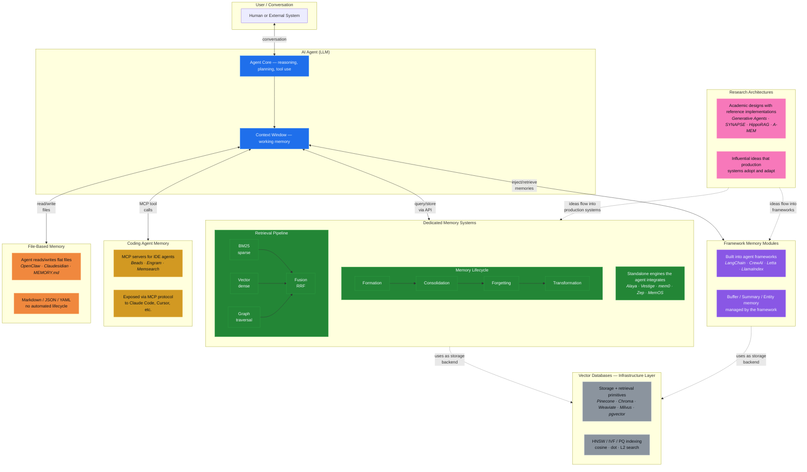

# Related Work: AI Agent Memory Systems

A comparative analysis of Alaya against existing memory architectures, organized
around the CoALA taxonomy (Sumers et al., 2024) and recent survey literature on
RAG and agent memory.

## Table of Contents

- [Analytical Framework](#analytical-framework)
- [System-by-System Analysis](#system-by-system-analysis)
  - [Production Systems](#production-systems)
  - [Framework-Level Memory](#framework-level-memory)
  - [Vector Databases as Memory](#vector-databases-as-memory)
  - [Additional Notable Systems](#additional-notable-systems)
  - [Academic / Research Systems](#academic--research-systems)
- [Comparative Matrices](#comparative-matrices)
  - [CoALA Dimension Analysis](#coala-dimension-analysis)
  - [Storage and Infrastructure](#storage-and-infrastructure)
  - [Retrieval Pipeline](#retrieval-pipeline)
  - [Memory Lifecycle](#memory-lifecycle)
- [Landscape Analysis](#landscape-analysis)
- [Where Alaya Sits](#where-alaya-sits)
  - [Taxonomic Position](#taxonomic-position)
  - [Why Alaya: Unique Value Propositions](#why-alaya-unique-value-propositions)
  - [Closest Alternatives and Critical Differences](#closest-alternatives-and-critical-differences)
  - [What Alaya Does Not Do](#what-alaya-does-not-do)
- [Tradeoffs: Embedded SQLite vs. External Infrastructure](#tradeoffs-embedded-sqlite-vs-external-infrastructure)
- [References](#references)

---

## Analytical Framework

This comparison uses three complementary frameworks:

**1. CoALA** (Sumers et al., 2024) classifies agent memory along three axes:
memory modules (working, episodic, semantic, procedural), action space (internal
reasoning/retrieval vs. external grounding), and decision-making procedure. It
draws on decades of cognitive architecture research (ACT-R, Soar) to provide a
principled vocabulary for comparing agent designs.

**2. RAG Survey Taxonomy** (Gao et al., 2023) classifies retrieval-augmented
systems as Naive, Advanced, or Modular RAG, with evaluation criteria including
context relevance, answer faithfulness, noise robustness, negative rejection,
and information integration.

**3. Agent Memory Survey** (Zhang et al., 2024) adds three dimensions: memory
sources (inside-trial vs. cross-trial), memory forms (natural language,
embeddings, databases, structured knowledge, parametric), and memory operations
(writing, management, reading).

Two additional surveys inform this analysis: "Memory in the Age of AI Agents"
(Hu et al., 2025), which proposes a Forms-Functions-Dynamics taxonomy, and "From
Human Memory to AI Memory" (Wu et al., 2025), which maps AI memory to human
cognitive structures via a 3D-8Q model (Object x Form x Time).

---

## System-by-System Analysis

### Production Systems

#### Mem0

- **Citation:** Choudhary et al. (2025). "Mem0: Building Production-Ready AI
  Agents with Scalable Long-Term Memory." arXiv:2504.19413.
- **Architecture:** Tiered memory with optional graph (Mem0g variant). Vector
  databases (Qdrant, Pinecone, Chroma) + relational DB for metadata + optional
  Neo4j for entity graphs.
- **CoALA mapping:** Episodic + semantic memory. Learning via LLM-driven
  extraction. Retrieval via vector similarity + graph traversal.
- **Retrieval:** Hybrid vector search + graph traversal with contextual tagging
  and priority scoring.
- **LLM dependency:** Required for memory extraction, conflict resolution, and
  update decisions.
- **Forgetting:** Exponential decay of low-relevance entries. Consolidation
  between short-term and long-term tiers.
- **Preference learning:** Yes — extracts user preferences and personality
  traits from interactions.
- **Key results:** 26% accuracy improvement over OpenAI memory on LOCOMO. 91%
  lower p95 latency vs. full-context approaches.
- **vs. Alaya:** Mem0 requires 2-3 external services and an LLM for every memory
  write. Alaya requires none. Mem0's forgetting is simple exponential decay;
  Alaya's Bjork model distinguishes storage strength from retrieval strength,
  enabling spaced-repetition-like dynamics. Mem0 extracts preferences via LLM
  prompts (brittle, expensive); Alaya accumulates impressions that crystallize
  into preferences organically. Mem0 is the right choice for cloud-deployed,
  multi-user SaaS products with dedicated infrastructure teams. Alaya is the
  right choice for privacy-first, single-user agents that must work offline.

#### Zep / Graphiti

- **Citation:** Dempsey et al. (2025). "Graphiti: Building Real-Time,
  Multi-Layered Temporal Knowledge Graphs." arXiv:2501.13956.
- **Architecture:** Hierarchical temporal knowledge graph on Neo4j. Three
  subgraph layers: Community (cluster summaries), Entity (semantic entities),
  Episodic (raw conversation episodes).
- **CoALA mapping:** Episodic + semantic memory. Learning via LLM-driven entity
  extraction. Retrieval via triple hybrid (cosine + BM25 + graph traversal).
- **Retrieval:** Cosine similarity + Okapi BM25 + breadth-first graph traversal.
  Multi-stage reranking (episode-mentions, node-distance, RRF, MMR). p95 ~300ms.
- **LLM dependency:** Required for entity/relationship extraction (gpt-4o-mini).
  Retrieval itself is LLM-free.
- **Forgetting:** Bi-temporal invalidation — facts are never deleted, only
  marked with validity periods. No decay curves.
- **Preference learning:** Indirect — preferences captured as graph
  nodes/edges.
- **Key results:** 94.8% on DMR benchmark. Up to 18.5% accuracy improvement on
  LongMemEval.
- **vs. Alaya:** Zep/Graphiti requires Neo4j infrastructure and an LLM for entity
  extraction. Their knowledge graph is static — entities and relationships exist
  only when the LLM creates them. Alaya's Hebbian graph is dynamic: it emerges
  from use patterns, strengthening co-retrieved connections and weakening unused
  ones without any LLM involvement. Zep's bi-temporal invalidation (facts are
  versioned, never deleted) is more conservative than Alaya's Bjork forgetting
  (retrieval strength genuinely decays, improving retrieval precision). Zep
  excels at structured factual recall; Alaya excels at associative, context-
  dependent retrieval where the memory landscape reshapes through interaction.

#### Letta (formerly MemGPT)

- **Citation:** Packer et al. (2023). "MemGPT: Towards LLMs as Operating
  Systems." arXiv:2310.08560.
- **Architecture:** OS-inspired three-tier hierarchy. Core Memory ("RAM," always
  in-context), Recall Memory (conversation history), Archival Memory ("disk,"
  unbounded vector/graph DB).
- **CoALA mapping:** Working memory (core) + episodic (recall) + semantic
  (archival). The LLM is the memory manager — it decides what to store, evict,
  and retrieve via tool calls.
- **Retrieval:** Agent-driven via tool calls. Vector similarity for archival.
  Sequential scan for recall.
- **LLM dependency:** Required — the LLM IS the memory manager.
- **Forgetting:** Eviction-based — when context fills, summarize and store old
  messages (~70% eviction). Sleep-time agents (2025) handle asynchronous
  reorganization.
- **Preference learning:** Yes — core memory blocks store and track evolving
  user preferences.
- **vs. Alaya:** Letta delegates all memory management to the LLM — the model
  decides what to store, evict, and retrieve. This makes Letta's memory quality
  entirely dependent on LLM capability and cost. Alaya's memory processes
  (consolidation, forgetting, perfuming) are deterministic algorithms grounded
  in cognitive science — they work identically regardless of which LLM (or no
  LLM) the agent uses. Letta's eviction is crude (summarize and drop ~70%);
  Alaya's forgetting is principled (weak retrieval strength decays, strong
  storage persists). Letta requires persistent infrastructure; Alaya is a single
  file.

#### Cognee

- **Citation:** cognee.ai. GitHub: topoteretes/cognee. $7.5M seed (2025).
- **Architecture:** Knowledge engine combining vector stores + graph databases
  (Neo4j, NetworkX). Transforms raw data into persistent, dynamic memory.
- **CoALA mapping:** Semantic memory with graph-structured knowledge.
- **Retrieval:** Hybrid vector + graph retrieval.
- **LLM dependency:** Required for knowledge extraction and graph construction.
- **Forgetting:** Not documented.
- **Key context:** 500x pipeline volume growth in 2025. Running in 70+
  companies. Backed by OpenAI and FAIR founders.
- **vs. Alaya:** Cognee is a knowledge engine, not a memory system — it
  transforms data into graph-structured knowledge but lacks forgetting,
  consolidation, and preference learning. Alaya treats memory as a living
  process with principled lifecycle management. Cognee requires Neo4j and an LLM
  for graph construction; Alaya's graph emerges from use with no external
  dependencies.

#### MemoryOS

- **Citation:** Kang et al. (2025). "MemoryOS: An Operating System-Like Memory
  Management Framework for LLM-Based Agents." arXiv:2506.06326. EMNLP 2025
  Oral.
- **Architecture:** Three-tier OS-inspired hierarchy (short-term, mid-term,
  long-term personal memory). Four modules: Storage, Updating, Retrieval,
  Generation.
- **CoALA mapping:** Working + episodic + semantic memory with tiered promotion.
- **Retrieval:** Hierarchical retrieval across tiers.
- **LLM dependency:** Required.
- **Forgetting:** FIFO eviction (short-to-mid), segmented page organization
  (mid-to-long).
- **Key results:** 49% F1 improvement and 46% BLEU-1 improvement on LoCoMo.
- **vs. Alaya:** MemoryOS and Alaya share the three-tier architecture insight but
  diverge on implementation. MemoryOS uses FIFO eviction and page-based
  organization — mechanical operations with no cognitive grounding. Alaya uses
  Bjork dual-strength forgetting and CLS consolidation — processes derived from
  how biological memory actually works. MemoryOS has no graph overlay or
  preference learning. MemoryOS is research code with LLM dependency; Alaya is
  an embeddable library with graceful degradation.

#### A-MEM

- **Citation:** Xu et al. (2025). "A-MEM: Agentic Memory for LLM Agents."
  arXiv:2502.12110. NeurIPS 2025.
- **Architecture:** Zettelkasten-inspired. Each memory is a structured "note"
  with contextual descriptions, keywords, and tags. Notes are dynamically linked
  via embedding similarity + LLM-driven relationship analysis.
- **CoALA mapping:** Semantic memory with emergent graph structure.
- **Retrieval:** Embedding-based query + linked note traversal.
- **LLM dependency:** Required for note construction, linking, and evolution.
- **Forgetting:** Evolution-based — notes are continuously updated, not deleted.
- **Key results:** Doubles multi-hop reasoning performance vs. baselines.
- **vs. Alaya:** A-MEM's Zettelkasten approach stores processed notes, not raw
  episodes — it has no episodic memory. Alaya preserves raw episodes AND
  distills semantic knowledge, maintaining the original context for
  encoding-specific retrieval. A-MEM's note "evolution" replaces old content;
  Alaya's transformation lifecycle explicitly handles contradictions and
  deduplication while preserving provenance. A-MEM requires an LLM for every
  note construction; Alaya stores episodes with no LLM involvement.

#### Supermemory

- **Citation:** Supermemory. GitHub: supermemoryai/supermemory. $2.6M seed
  (Susa Ventures, backed by Google AI chief Jeff Dean).
- **Architecture:** Knowledge graph + vector store + graph database. Brain-
  inspired with smart forgetting, decay curves, recency bias, and context
  rewriting. Memories are indexed into both vector store and graph database.
  Memories can update, extend, derive, and expire.
- **CoALA mapping:** Episodic + semantic memory with graph overlay.
- **Retrieval:** Hybrid vector + graph retrieval.
- **LLM dependency:** Required for memory extraction and context rewriting.
- **Forgetting:** Yes — decay curves with recency bias. Memories expire.
- **Key context:** 16.6K GitHub stars. Claims 10x faster than Zep, 25x faster
  than Mem0. Founded by 19-year-old Dhravya Shah. Customers include Cluely
  (a16z-backed). TypeScript.
- **vs. Alaya:** Supermemory is the most traction-heavy competitor (16.6K stars,
  VC-backed). It uses decay curves and expiry, but these are ad-hoc rather than
  grounded in forgetting theory. Its graph is static (LLM-extracted), not
  Hebbian. It requires 2-3 external services and an LLM for all operations.
  Supermemory is optimized for cloud SaaS products with infrastructure teams;
  Alaya is optimized for embedded, privacy-first, zero-dependency agents.
  Supermemory's TypeScript stack limits embedding in non-JS environments; Alaya's
  Rust is embeddable in any language via FFI.

#### PageIndex (Vectify AI)

- **Citation:** Zhang, M. & Tang, Y. (2025). "PageIndex: Document Index for
  Vectorless, Reasoning-based RAG." pageindex.ai. MIT License.
- **Architecture:** Vectorless retrieval system. Replaces vector databases with
  hierarchical tree indexing inspired by AlphaGo's tree search. Two-step process:
  (1) generate a Table-of-Contents tree structure from documents with LLM
  summaries at each node, (2) LLM reasons over the tree to find relevant
  sections. No chunking — respects natural document structure.
- **CoALA mapping:** Not a memory system — a retrieval system. No episodic,
  semantic, or procedural memory. Stateless document navigation.
- **Storage:** JSON tree index file. No vector database.
- **Retrieval:** LLM reasoning-based tree traversal. At each level, the LLM
  evaluates which branch is most relevant to the query. Explainable — produces
  reasoning traces with section/page references.
- **LLM dependency:** Required (OpenAI, default gpt-4o). The entire system
  depends on LLM reasoning for both indexing and retrieval.
- **Forgetting:** None. Deterministic based on document structure.
- **Key results:** 98.7% accuracy on FinanceBench (financial document QA).
  17.9K GitHub stars, 1.3K forks. MCP integration for Claude. Cloud platform
  (chat.pageindex.ai) and enterprise deployment.
- **Key context:** Represents a fundamentally different retrieval paradigm —
  reasoning over structure instead of similarity over embeddings. Most effective
  for long professional documents (SEC filings, legal contracts) where semantic
  similarity fails to capture true relevance.
- **vs. Alaya:** PageIndex is a retrieval system, not a memory system — it has
  no episodic memory, no learning, no forgetting, no preferences, no graph
  dynamics. It solves a different problem: expert-level document navigation for
  structured professional documents. Alaya solves conversational memory with
  cognitive lifecycle processes. However, PageIndex's tree-based reasoning
  retrieval is an interesting complement to Alaya's hybrid retrieval — where
  Alaya uses BM25 + vector + graph spreading activation, PageIndex argues that
  LLM reasoning over hierarchical structure outperforms vector similarity
  entirely. For Alaya's use case (short conversational episodes, not 100-page
  PDFs), vector + BM25 + graph is more appropriate than PageIndex's heavyweight
  LLM-reasoning-per-query approach. PageIndex also requires an LLM for every
  retrieval query; Alaya's retrieval is LLM-free.

#### Hindsight (Vectorize)

- **Citation:** Latimer et al. (2025). "Hindsight is 20/20: Building Agent
  Memory that Retains, Recalls, and Reflects." arXiv:2512.12818.
- **Architecture:** Four logical memory networks: world (objective facts),
  experience (agent experiences), opinion (subjective beliefs with confidence
  scores that evolve), observation (preference-neutral entity summaries). Tempr
  for temporal entity memory priming retrieval. Cara for coherent adaptive
  reasoning.
- **CoALA mapping:** Episodic + semantic + opinion memory (novel category).
- **Retrieval:** Temporal entity priming + adaptive reasoning.
- **LLM dependency:** Required. Supports OpenAI, Anthropic, Gemini, Groq,
  Ollama.
- **Forgetting:** Not explicit — belief confidence scores evolve over time.
- **Key results:** Claims SOTA: 91.4% LongMemEval, 89.61% LoCoMo.
  Distinguishes facts from opinions with confidence-scored belief evolution.
- **vs. Alaya:** Hindsight's opinion memory with belief evolution is the most
  novel contribution in the field — Alaya's vasana model addresses the same
  problem (tracking evolving preferences) from a different angle. Hindsight
  tracks opinions explicitly with confidence scores; Alaya lets preferences
  crystallize implicitly from accumulated impressions. Hindsight's four-network
  decomposition (world, experience, opinion, observation) is finer-grained than
  Alaya's three stores, but lacks a graph overlay and principled forgetting.
  Hindsight requires an LLM and external infrastructure; Alaya requires neither.

#### Cortex-Mem

- **Citation:** sopaco. GitHub: sopaco/cortex-mem. cortexmemory.dev.
- **Architecture:** Production-ready memory framework. Automatic extraction,
  vector search, deduplication, optimization. REST API + MCP server + CLI +
  insights dashboard.
- **CoALA mapping:** Semantic memory (extracted facts).
- **Storage:** Configurable. **Written in Rust.**
- **Retrieval:** Vector similarity search.
- **LLM dependency:** Required for fact extraction.
- **Forgetting:** Not documented.
- **Key context:** The closest Rust-based competitor. Same language as Alaya,
  but positioned as a standalone service (REST/MCP) rather than an embeddable
  library. Claims 60-90% storage savings via deduplication.
- **vs. Alaya:** Both are Rust. But Cortex-Mem is a standalone service (REST/MCP)
  that extracts facts via LLM — it requires an LLM for all operations and has
  no graph, no forgetting, no consolidation, no preference emergence. Alaya is
  an embeddable library that works with or without an LLM and provides the full
  cognitive memory lifecycle. Cortex-Mem's deduplication is a strength Alaya
  addresses through its transformation lifecycle.

#### Memvid

- **Citation:** Memvid. GitHub: memvid/memvid. memvid.com.
- **Architecture:** Video-encoding-inspired architecture with Smart Frames as
  append-only immutable units. Embedded WAL for crash recovery. Single `.mv2`
  binary format file. ONNX local embeddings (bge-small, nomic-embed).
- **CoALA mapping:** Episodic memory (append-only).
- **Storage:** Single `.mv2` file. **Written in Rust** (V2 rewrite).
- **Retrieval:** Tantivy full-text + HNSW vector + chronological time indexing.
- **LLM dependency:** None for storage/retrieval. Local ONNX embeddings.
- **Forgetting:** None — append-only, immutable.
- **Key results:** Claims SOTA on LoCoMo (+35%). 0.025ms P50 / 0.075ms P99.
  1,372x throughput vs. standard approaches. 13.2K GitHub stars. Python + Node
  + Rust + CLI + MCP bindings.
- **Key context:** The closest deployment model to Alaya (Rust, single-file,
  zero dependencies). Key difference: Memvid is append-only with no forgetting
  or consolidation; Alaya has cognitive lifecycle processes.
- **vs. Alaya:** Memvid is the closest system in deployment model — Rust, single
  file, zero external dependencies, zero LLM requirement. But Memvid is a log,
  not a memory system. It has no semantic store, no graph, no forgetting, no
  consolidation, no preferences, no contradiction resolution. Memories are
  immutable Smart Frames that can only be appended. Alaya provides the full
  cognitive lifecycle on the same zero-ops deployment footprint. Memvid's
  Tantivy + HNSW retrieval is faster than Alaya's SQLite-based approach for
  pure search, but cannot provide associative graph retrieval or spreading
  activation.

#### Redis Agent Memory Server

- **Citation:** Redis Labs. GitHub: redis/agent-memory-server.
- **Architecture:** Auto-extracts, organizes, deduplicates memories. REST API +
  MCP interfaces. Topic extraction (LLM or BERTopic), NER, HNSW vector
  indexing. Multi-tenancy.
- **CoALA mapping:** Semantic memory (extracted topics and entities).
- **Storage:** Redis (default) + Pinecone/Chroma/PostgreSQL backends.
- **Retrieval:** HNSW vector search + topic filtering.
- **LLM dependency:** Required for extraction. 100+ providers via LiteLLM.
- **Forgetting:** Not documented.
- **Key context:** Official Redis project (v0.13.1). Docker deployment.
  Represents a major infrastructure company entering the memory space.
- **vs. Alaya:** Redis Memory extracts topics and entities but has no graph
  overlay, no forgetting, no consolidation, and no preference learning. It is a
  memory-shaped wrapper around Redis infrastructure. Alaya provides the full
  cognitive memory lifecycle. Redis Memory requires Docker + Redis; Alaya is a
  single file.

#### LangMem SDK

- **Citation:** LangChain team. GitHub: langchain-ai/langmem.
- **Architecture:** Dedicated long-term memory SDK, distinct from the deprecated
  LangChain Memory classes. Semantic memory (facts/preferences) + procedural
  memory (saved as updated prompt instructions). Functional primitives +
  LangGraph storage integration. Namespace-based multi-tenancy.
- **CoALA mapping:** Semantic + procedural memory.
- **Retrieval:** Vector similarity via LangGraph store.
- **LLM dependency:** Required for extraction.
- **Forgetting:** Not documented.
- **Key context:** LangChain's actual memory engine for production use.
  48.72 F1 on LoCoMo. 1.3K GitHub stars.
- **vs. Alaya:** LangMem is semantic + procedural memory without episodic
  storage, graph, forgetting, or preference emergence. Its procedural memory
  (prompt updates) is a novel capability Alaya does not offer. However, LangMem
  is tightly coupled to LangGraph's storage layer and requires an LLM for
  extraction. Alaya is framework-agnostic and provides richer memory semantics.

---

### Standalone Memory Servers

#### Motorhead (Metal)

- **Citation:** Metal. GitHub: getmetal/motorhead. Apache 2.0. YC-backed.
- **Architecture:** Flat conversation buffer with incremental summarization.
  Stores messages per session with a configurable window size (default 12). When
  the window fills, the oldest half is summarized and the summary is
  incrementally updated.
- **CoALA mapping:** Working memory (buffer) with rudimentary episodic
  (summaries).
- **Storage:** Redis (required). Redisearch VSS for long-term retrieval.
- **Language:** Rust server with Python/JS client libraries.
- **Retrieval:** Session-based retrieval (GET messages). Vector similarity via
  Redisearch VSS. Three simple REST endpoints.
- **LLM dependency:** Required for incremental summarization (default:
  gpt-3.5-turbo).
- **Forgetting:** Window-based eviction — oldest half summarized and removed.
  No time-based decay.
- **Key context:** Written in Rust for performance. Extremely simple API.
  LangChain integration via MotorheadMemory class. Less actively maintained as
  of 2025.
- **vs. Alaya:** Motorhead is a conversation buffer, not a memory system. It has
  no graph, no semantic store, no forgetting model, no preference learning, and
  no consolidation — just a sliding window with summarization. Alaya provides
  the full cognitive memory lifecycle that Motorhead's architecture cannot
  support. Both are written in Rust, but Motorhead requires Redis infrastructure
  while Alaya requires nothing.

#### Engram

- **Citation:** Gentleman-Programming. GitHub: Gentleman-Programming/engram.
- **Architecture:** Flat, agent-directed memory. The agent (Claude Code, Gemini
  CLI, etc.) decides what to save. Session-based with automatic context
  injection on session start and summary generation on session end.
- **CoALA mapping:** Working memory + agent-directed episodic writes.
- **Storage:** SQLite + FTS5 (full-text search). Single binary, single file.
- **Language:** Go.
- **Retrieval:** Full-text search via FTS5. No vector search. Agent proactively
  saves relevant memories.
- **LLM dependency:** None for storage/retrieval. The LLM client decides what to
  remember.
- **Forgetting:** No built-in mechanism.
- **Key context:** Zero dependencies — single Go binary. MCP server + HTTP API +
  CLI + TUI. Designed for coding agents. Agent-trusting philosophy (agent
  decides what is worth remembering). Closest in spirit to Alaya's
  zero-dependency approach, though without vector search, graph, or lifecycle
  processes.
- **vs. Alaya:** Engram and Alaya share the zero-dependency, single-file
  philosophy. But Engram is a flat key-value store with FTS5 — no semantic
  store, no graph, no forgetting, no consolidation, no preferences, no vector
  search. Alaya provides the full cognitive memory architecture on the same
  deployment footprint. Engram delegates all memory decisions to the agent;
  Alaya provides intelligent memory management that works independently of
  agent sophistication.

#### OpenViking (ByteDance / Volcengine)

- **Citation:** Volcengine. GitHub: volcengine/OpenViking. Open-sourced January
  2026.
- **Architecture:** Virtual filesystem paradigm. Abandons fragmented vector
  storage in favor of a `viking://` protocol that maps all context (memories,
  resources, skills) to virtual directories. Three-tier structure: L0 (immediate
  context), L1 (session-level), L2 (persistent/archival).
- **CoALA mapping:** Working memory (L0) + episodic (L1) + semantic (L2).
- **Storage:** Custom virtual filesystem built on VikingDB vector database
  infrastructure.
- **Retrieval:** Directory recursive retrieval combining directory positioning
  with semantic search. Hierarchical context delivery.
- **LLM dependency:** Required for context processing and agent interaction.
- **Forgetting:** Not explicitly documented. Tiered loading implicitly
  deprioritizes unused context.
- **Key context:** Novel filesystem metaphor for context management. Built by
  the team behind VikingDB (serves all ByteDance production workloads since
  2019). Designed for coding agents (e.g., OpenClaw). Strongly opinionated
  against traditional RAG fragmentation. ~2.9K GitHub stars.
- **vs. Alaya:** OpenViking's filesystem metaphor (directories, paths) is a
  fundamentally different abstraction from Alaya's cognitive model (episodes,
  semantics, impressions). OpenViking has no forgetting, no graph dynamics, no
  preference learning, and requires VikingDB infrastructure. Its tiered loading
  is mechanical (L0/L1/L2 directories), not cognitive (episodic → semantic
  consolidation). OpenViking targets coding agents with structured context;
  Alaya targets conversational agents with associative, evolving memory.

---

### Framework-Level Memory

#### LangChain Memory

- **Citation:** LangChain documentation. MIT License.
- **Architecture:** Multiple flat, conversation-centric memory classes:
  ConversationBufferMemory (full history), ConversationSummaryMemory (LLM
  rolling summaries), ConversationBufferWindowMemory (sliding window),
  ConversationEntityMemory (entity tracking).
- **CoALA mapping:** Working memory only. No long-term persistence by default.
- **Retrieval:** Direct injection into prompt template. No semantic search in
  base classes.
- **LLM dependency:** Optional — buffer/window classes need none; summary and
  entity classes require LLM.
- **Forgetting:** Truncation-based only (window drops, token buffer drops). No
  intelligent decay.
- **Key context:** Most widely adopted but also most basic. Most memory classes
  now deprecated in favor of RunnableWithMessageHistory.
- **vs. Alaya:** LangChain Memory is working memory only — no long-term
  persistence, no semantic store, no graph, no forgetting model, no preferences.
  It is the "hello world" of agent memory. Alaya provides the complete cognitive
  memory architecture that LangChain's buffer/window classes were never designed
  to offer. LangChain's own team replaced these with LangMem SDK (see above).

#### LlamaIndex Memory

- **Citation:** LlamaIndex documentation. MIT License.
- **Architecture:** Composable short-term + long-term blocks. Short-term is FIFO
  queue. Long-term via pluggable Memory Blocks (StaticMemoryBlock,
  FactExtractionMemoryBlock, VectorMemoryBlock).
- **CoALA mapping:** Working memory + optional episodic/semantic via blocks.
- **Retrieval:** Depends on block type — structured lookup, vector similarity.
  Configurable token ratio (70% chat history / 30% long-term by default).
- **LLM dependency:** Optional — basic buffer needs none.
  FactExtractionMemoryBlock requires LLM.
- **Forgetting:** FIFO eviction when chat exceeds token ratio.
- **vs. Alaya:** LlamaIndex's composable blocks are flexible but shallow — FIFO
  eviction and fact extraction are the extent of memory management. No graph, no
  principled forgetting, no consolidation, no preference emergence. Alaya
  provides the deeper memory semantics that LlamaIndex's blocks do not address.

#### Haystack (deepset)

- **Citation:** deepset. GitHub: deepset-ai/haystack. Apache 2.0.
- **Architecture:** Pipeline-based, modular. Memory is a component within
  Haystack's explicit pipeline architecture, not a primary focus.
- **CoALA mapping:** Working memory. Long-term via external integrations (Mem0).
- **Retrieval:** Pipeline-based through Haystack retriever components.
- **LLM dependency:** Optional for base memory.
- **Forgetting:** No built-in mechanism.
- **Key context:** Advanced Agent Memory was P3 (low priority) on Q1 2025
  roadmap.
- **vs. Alaya:** Haystack treats memory as a low-priority pipeline component, not
  a first-class concern. Alaya is purpose-built for memory with four lifecycle
  processes, three stores, and a Hebbian graph — capabilities that Haystack's
  architecture cannot provide.

#### LangGraph

- **Citation:** LangChain team. Part of LangChain ecosystem.
- **Architecture:** Graph-based agent orchestration with state persistence.
  Memory is modeled as graph state that persists across interactions. Checkpoints
  enable conversation resumption.
- **CoALA mapping:** Working memory (graph state) + episodic (checkpoints).
- **Retrieval:** State-based — the graph state IS the memory.
- **LLM dependency:** Required for agent execution.
- **Forgetting:** No built-in mechanism beyond state management.
- **Key context:** Not a memory system per se — a stateful orchestration
  framework. Memory is an emergent property of persistent graph execution.
- **vs. Alaya:** LangGraph is an orchestration framework, not a memory system.
  Its "memory" is persistent graph state — useful for maintaining conversation
  flow, but it provides no episodic/semantic distinction, no forgetting, no
  consolidation, and no preference learning. Alaya provides the memory
  architecture that LangGraph's state management does not address.

---

### Vector Databases as Memory

These systems are infrastructure components, not memory architectures. They
provide the storage and retrieval layer that memory systems build on.

| System | Language | Index Type | Hybrid Search | Managed Cloud | OSS License | GitHub Stars |
|--------|----------|-----------|---------------|---------------|-------------|-------------|
| **Pinecone** | Cloud-native | Proprietary adaptive | No native BM25 | Yes (only option) | Proprietary | N/A |
| **ChromaDB** | Python | HNSW | FTS + vector | Chroma Cloud | Apache 2.0 | ~23K |
| **Weaviate** | Go | HNSW + BM25/SPLADE | Yes (native) | Weaviate Cloud | BSD-3 | ~14K |
| **Milvus** | Go/C++ | HNSW, IVF, DiskANN, GPU | Dense + sparse | Zilliz Cloud | Apache 2.0 | ~40K |
| **Cloudflare Vectorize** | Cloud-native | Proprietary | Via Workers AI | Yes (only option) | Proprietary | N/A |

**Relevance to Alaya:** These are all potential future backends if alaya
outgrows SQLite's brute-force vector search. They do not provide memory
semantics (stores, lifecycle, graph, forgetting) — only vector storage and ANN
retrieval.

---

### Academic / Research Systems

#### Generative Agents (Park et al., 2023)

- **Citation:** Park et al. (2023). "Generative Agents: Interactive Simulacra of
  Human Behavior." ACM UIST 2023. arXiv:2304.03442.
- **Architecture:** Memory stream (chronological observations) + reflections
  (higher-order thoughts) + plans (future actions).
- **Retrieval:** Triple-scored: recency (exponential decay) x importance
  (LLM-rated 1-10) x relevance (cosine similarity). The foundational retrieval
  formula for agent memory.
- **Forgetting:** Exponential recency decay. Unaccessed memories score lower.
- **Significance:** The seminal paper that launched modern agent memory research.
  The recency/importance/relevance scoring is now widely copied.
- **vs. Alaya:** Generative Agents pioneered agent memory but uses in-memory
  storage (ephemeral), a flat memory stream (no stores), no graph overlay, and
  single-curve recency decay. Alaya's Bjork forgetting model is more
  sophisticated (dual-strength), its three-store architecture provides
  structural organization, and its Hebbian graph enables associative retrieval
  that Generative Agents' cosine-only approach cannot match. Generative Agents'
  "reflections" (episodic → higher-order thoughts) inspired Alaya's
  consolidation pipeline.

#### Reflexion (Shinn et al., 2023)

- **Citation:** Shinn et al. (2023). "Reflexion: Language Agents with Verbal
  Reinforcement Learning." NeurIPS 2023. arXiv:2303.11366.
- **Architecture:** Episodic self-reflection buffer. After each trial, the agent
  generates a natural language self-reflection. Bounded to 1-3 entries.
- **Significance:** Reframes memory as "verbal reinforcement learning." 91%
  pass@1 on HumanEval vs. GPT-4's 80%.
- **vs. Alaya:** Reflexion's 1-3 entry self-reflection buffer is a minimal
  episodic store — no semantic consolidation, no graph, no forgetting, no
  preferences. It demonstrates that even tiny memory with the right content
  (self-reflections) can dramatically improve performance. Alaya's full memory
  architecture could complement Reflexion's approach — storing reflections as
  episodes that consolidate into semantic knowledge.

#### Voyager (Wang et al., 2023)

- **Citation:** Wang et al. (2023). "Voyager: An Open-Ended Embodied Agent with
  Large Language Models." arXiv:2305.16291.
- **Architecture:** Executable skill library — memories are stored as reusable
  JavaScript code, not natural language. Append-only, verified skills.
- **CoALA mapping:** Pure procedural memory. The only system in this survey
  focused on procedural memory.
- **Significance:** First LLM-powered embodied lifelong learning agent. Memory
  as executable code. 15.3x faster tech tree progression vs. baselines.
- **vs. Alaya:** Voyager is pure procedural memory (executable skills) — the only
  system in this survey focused on procedural memory. Alaya does not provide
  procedural memory. These are complementary systems: Voyager stores "how to do
  things" as code; Alaya stores "what happened and what was learned" as
  episodes, knowledge, and preferences.

#### MemoryBank (Zhong et al., 2024)

- **Citation:** Zhong et al. (2024). "MemoryBank: Enhancing Large Language
  Models with Long-Term Memory." AAAI 2024. arXiv:2305.10250.
- **Architecture:** Three-module (Writer + Retriever + Reader). Stores
  conversations, events, and user portraits.
- **Forgetting:** Ebbinghaus Forgetting Curve: R = e^(-t/S). Recalled memories
  strengthen (S increments, t resets). The first system to formally implement
  Ebbinghaus forgetting in LLM memory.
- **Preference learning:** Explicit user portrait construction.
- **vs. Alaya:** MemoryBank is the first system to implement Ebbinghaus
  forgetting in LLM memory. Its single-curve model (R = e^(-t/S)) is simpler
  than Alaya's Bjork dual-strength model, which tracks storage and retrieval
  strength independently. MemoryBank's user portrait synthesis is an early form
  of preference learning; Alaya's vasana model accumulates impressions more
  organically. MemoryBank has no graph overlay or consolidation.

#### Think-in-Memory (Liu et al., 2023)

- **Citation:** Liu et al. (2023). "Think-in-Memory: Recalling and
  Post-Thinking Enable LLMs with Long-Term Memory." arXiv:2311.08719.
- **Architecture:** Stores processed "thoughts" (reasoning conclusions) rather
  than raw events. Locality-Sensitive Hashing for O(1) retrieval.
- **Forgetting:** Explicit forget and merge operations.
- **Significance:** Unique approach — storing reasoning results rather than
  observations.
- **vs. Alaya:** Think-in-Memory stores processed thoughts (reasoning
  conclusions), not raw episodes. Alaya preserves both — raw episodes for
  context-dependent retrieval and distilled semantic knowledge from
  consolidation. Think-in-Memory's LSH for O(1) retrieval is faster than
  Alaya's hybrid pipeline, but at the cost of losing the multi-signal fusion
  (BM25 + vector + graph) that enables richer retrieval.

#### Second Me (Mindverse, 2025)

- **Citation:** Second Me (2025). "SecondMe: Building the AI Version of
  Yourself." arXiv:2503.08102.
- **Architecture:** Three-layer HMM: L0 (short-term context), L1 (mid-term
  abstracted), L2 (AI-Native Memory — long-term knowledge encoded directly into
  model parameters via fine-tuning).
- **Significance:** Unique "memory as model parameters" approach. Parametric
  memory eliminates retrieval latency for deeply learned knowledge.
- **vs. Alaya:** Second Me represents a fundamentally different paradigm —
  parametric memory encoded in model weights via fine-tuning. Alaya uses
  non-parametric memory (stored in a database). Parametric memory eliminates
  retrieval latency but requires fine-tuning infrastructure, is opaque
  (no inspection/debugging), and cannot be selectively forgotten. Alaya's
  non-parametric approach is transparent, inspectable, and supports principled
  forgetting. These are complementary paradigms, not competitors.

#### HippoRAG / HippoRAG 2 (OSU NLP, 2024-2025)

- **Citation:** Gutierrez et al. (2024). "HippoRAG: Neurobiologically Inspired
  Long-Term Memory for Large Language Models." NeurIPS 2024. arXiv:2405.14831.
  Gutierrez et al. (2025). "From RAG to Memory." ICML 2025. arXiv:2502.14802.
- **Architecture:** Inspired by hippocampal indexing theory. LLM acts as
  neocortex, PHR encoder detects synonymy, open knowledge graph acts as
  hippocampus. Retrieval via Personalized PageRank on the KG.
- **Forgetting:** Not built-in.
- **Key results:** 20% improvement on multi-hop QA. 10-30x cheaper than
  iterative retrieval. ~3.7K GitHub stars.
- **Significance:** Top-venue neuroscience-inspired memory. PPR on KG is
  comparable to Alaya's spreading activation on Hebbian graph — different
  mechanisms, similar cognitive inspiration.
- **vs. Alaya:** Both are neuroscience-inspired, but from different theories.
  HippoRAG models the hippocampal indexing theory (neocortex + hippocampus +
  parahippocampal region); Alaya models Hebbian plasticity and CLS theory.
  HippoRAG's knowledge graph is static (LLM-extracted entities); Alaya's is
  dynamic (reshapes through use). HippoRAG has no forgetting, no consolidation,
  no preferences, and requires an LLM for all KG construction. Alaya provides
  the full cognitive lifecycle with zero LLM requirement. HippoRAG is stronger
  for document-grounded multi-hop QA; Alaya is stronger for conversational
  memory with evolving preferences.

#### SYNAPSE (Jiang et al., 2026)

- **Citation:** Jiang et al. (2026). "SYNAPSE: Empowering LLM Agents with
  Episodic-Semantic Memory via Spreading Activation." arXiv:2601.02744.
- **Architecture:** Unified episodic-semantic graph with spreading activation
  AND lateral inhibition (biological mechanisms). Triple hybrid retrieval fusing
  geometric embeddings with activation-based graph traversal. Temporal decay.
- **Key results:** +7.2 F1 on LoCoMo (SOTA at publication). 23% improvement on
  multi-hop reasoning. 95% token reduction vs. full context.
- **Significance:** The most directly comparable system to Alaya's retrieval
  approach. Both use spreading activation over episodic-semantic graphs. SYNAPSE
  adds lateral inhibition (analogous to Alaya's RIF suppression).
- **vs. Alaya:** SYNAPSE is Alaya's closest competitor in retrieval architecture.
  Both use spreading activation on episodic-semantic graphs. SYNAPSE adds
  lateral inhibition (analogous to Alaya's RIF); Alaya adds Hebbian weight
  evolution (LTP/LTD). SYNAPSE has no preference learning, no CLS
  consolidation, and no Bjork forgetting — its lifecycle is simpler. SYNAPSE is
  in-memory Python research code; Alaya is a persistent, embeddable Rust
  library. For the specific mechanism of associative retrieval, these two
  systems are the state of the art.

#### Mem-alpha (Wang et al., 2025)

- **Citation:** Wang et al. (2025). "Mem-alpha: Learning Memory Construction
  via Reinforcement Learning." arXiv:2509.25911.
- **Architecture:** RL framework training agents to manage core, episodic, and
  semantic memory. Reward signal from downstream QA accuracy. Trained on 30K
  tokens, generalizes to 400K+ (13x extrapolation).
- **Key results:** Apache 2.0. GitHub: wangyu-ustc/Mem-alpha.
- **Significance:** Nearly identical three-component memory decomposition to
  Alaya (core + episodic + semantic). Key difference: Mem-alpha learns
  management via RL; Alaya uses cognitive principles.
- **vs. Alaya:** The most architecturally similar system. Same three-store
  decomposition (core/episodic/semantic). The fundamental divergence is
  governance: Mem-alpha learns memory management via RL reward signals; Alaya
  uses hand-crafted cognitive processes (Bjork forgetting, CLS consolidation,
  vasana perfuming). RL can potentially discover better policies, but requires
  training data and is opaque. Alaya's cognitive processes are interpretable,
  require no training, and work on first use.

#### MAGMA (Jiang et al., 2026)

- **Citation:** Jiang et al. (2026). "MAGMA: A Multi-Graph based Agentic Memory
  Architecture." arXiv:2601.03236.
- **Architecture:** Four orthogonal graphs per memory item: semantic, temporal,
  causal, and entity. Adaptive traversal policy routes retrieval based on query
  intent. Dual-stream write: fast ingestion + async consolidation.
- **Key results:** SOTA on LoCoMo and LongMemEval.
- **Significance:** Multi-graph decomposition is a different approach from
  Alaya's single Hebbian graph with multiple edge types. MAGMA separates
  graph types; Alaya unifies them with typed, weighted edges.
- **vs. Alaya:** MAGMA decomposes memory relationships into four separate graphs
  (semantic, temporal, causal, entity) with adaptive traversal policies. Alaya
  uses a single Hebbian graph with typed, weighted edges. MAGMA's decomposition
  enables specialized traversal per graph type; Alaya's unified graph enables
  cross-type associations through spreading activation. MAGMA achieves SOTA on
  LoCoMo and LongMemEval, but is Python research code. MAGMA has no preference
  learning or Bjork forgetting.

#### LightMem (Fang et al., 2025)

- **Citation:** Fang et al. (2025). "LightMem: Lightweight and Efficient
  Memory-Augmented Generation." ICLR 2026. arXiv:2510.18866.
- **Architecture:** Atkinson-Shiffrin-inspired three-stage pipeline: sensory
  memory (compression + topic grouping), short-term (topic-aware consolidation),
  long-term with "sleep-time" offline consolidation.
- **Key results:** 38x token reduction, 30x fewer API calls, 12.4x faster.
- **Significance:** Best efficiency profile. Sleep-time consolidation pattern
  parallels Alaya's offline lifecycle processes. Both inspired by
  complementary learning systems.
- **vs. Alaya:** Both are CLS-inspired with offline consolidation. LightMem's
  sleep-time consolidation mirrors Alaya's lifecycle processes. LightMem adds a
  sensory memory stage (compression + topic grouping) that Alaya does not have.
  LightMem achieves the best efficiency profile in the field (38x token
  reduction). However, LightMem has no graph overlay, no Hebbian dynamics, no
  preference learning, and no Bjork forgetting. LightMem is Python; Alaya is
  Rust.

#### MemTree (Rezazadeh et al., 2025)

- **Citation:** Rezazadeh et al. (2025). "MemTree: Dynamic Tree Memory." ICLR
  2025. arXiv:2410.14052.
- **Architecture:** Dynamic tree-structured memory mimicking cognitive schemas.
  Hierarchical nodes at varying abstraction levels. New information routes from
  root to matching leaf. Ancestor nodes integrate via summarization.
- **Significance:** Tree vs. graph is a fundamental structural difference from
  Alaya. MemTree's hierarchical schemas enable top-down reasoning; Alaya's flat
  stores + graph overlay enable lateral associative reasoning.
- **vs. Alaya:** Fundamentally different data structures: MemTree's hierarchical
  tree enables top-down schema-based reasoning; Alaya's flat stores + Hebbian
  graph enable lateral associative reasoning. Trees are better for structured
  taxonomic knowledge; graphs are better for associative, context-dependent
  retrieval. MemTree has no forgetting, no preferences, and is Python research
  code.

#### RMM (Tan et al., 2025)

- **Citation:** Tan et al. (2025). "In Prospect and Retrospect: Reflective
  Memory Management for Long-term Personalized Dialogue Agents." ACL 2025.
  arXiv:2503.08026.
- **Architecture:** Prospective reflection (dynamic summarization across
  utterance/turn/session granularities) + retrospective reflection (online RL
  refinement of retrieval based on cited evidence).
- **Key results:** 10%+ accuracy improvement on LongMemEval.
- **Significance:** Explicitly designed for personalized conversational agents
  — the same target as Alaya.
- **vs. Alaya:** RMM targets the same use case as Alaya — long-term personalized
  conversational agents. RMM's prospective reflection (dynamic summarization)
  parallels Alaya's consolidation; its retrospective reflection (RL-refined
  retrieval) parallels Alaya's Hebbian graph dynamics. RMM combines hand-crafted
  and RL-learned processes; Alaya uses purely cognitive-principle-based
  processes. RMM has no graph overlay, no preference emergence, and is Python.

### Additional Notable Systems

Systems with significant community traction or novel ideas. Each is compared
against Alaya's architecture.

#### EverMemOS

- **Type:** Memory OS. Self-organizing memory with encoding/consolidation/
  retrieval pipeline. 93% LoCoMo. 2.2K stars.
- **vs. Alaya:** EverMemOS's encoding/consolidation/retrieval pipeline parallels
  Alaya's lifecycle processes. Both are CLS-inspired. Key difference: EverMemOS
  is Python research code requiring LLM infrastructure; Alaya is an embeddable
  Rust library with zero dependencies. EverMemOS lacks Hebbian graph dynamics
  and preference emergence.

#### MemOS

- **Type:** Memory OS. Textual + activation (KV cache) + parametric (LoRA)
  memory types. 5.9K stars.
- **vs. Alaya:** MemOS introduces activation memory (KV cache persistence) and
  parametric memory (LoRA fine-tuning) — memory forms that Alaya does not
  support. These are powerful for inference optimization but require GPU
  infrastructure. Alaya's CPU-only, single-file approach trades these
  capabilities for deployment simplicity and privacy.

#### OpenMemory

- **Type:** Cognitive engine. Hierarchical Memory Decomposition + temporal
  graph; MCP native. 3.4K stars.
- **vs. Alaya:** OpenMemory's temporal graph is static (LLM-constructed);
  Alaya's Hebbian graph is dynamic (reshapes through use). OpenMemory's MCP
  integration is appealing for tool-use agents, but it requires external
  infrastructure and an LLM. Alaya's trait-based API is more flexible for
  embedding in any architecture.

#### SimpleMem

- **Type:** Compression. Semantic lossless compression via implicit density
  gating. 3.0K stars.
- **vs. Alaya:** SimpleMem solves a different problem — compressing conversation
  context to fit in LLM windows. It has no long-term memory, no graph, no
  forgetting, no consolidation. Alaya provides the long-term memory
  architecture that SimpleMem's compression approach does not address. These are
  complementary: SimpleMem compresses what goes into the prompt; Alaya decides
  what is worth remembering.

#### Memobase

- **Type:** User profiling engine. Extracts user profiles from conversations;
  top LoCoMo scores. 2.6K stars.
- **vs. Alaya:** Memobase focuses narrowly on user profile extraction — it
  builds structured profiles (interests, demographics, preferences) from
  conversations. Alaya's vasana model captures preferences but also provides
  episodic memory, semantic consolidation, graph dynamics, and forgetting —
  a complete memory system rather than a profiling tool. Memobase requires an
  LLM for all extraction; Alaya's preference emergence needs no LLM.

#### IronClaw

- **Type:** Rust agent with persistent hybrid-search memory. 3.5K stars.
- **vs. Alaya:** IronClaw is an agent, not a memory library — it bundles memory
  as part of a complete agent system. Alaya is a headless memory engine that any
  agent can use. IronClaw's memory is tightly coupled to its agent architecture;
  Alaya is composable and framework-agnostic. Both are Rust, demonstrating the
  growing Rust ecosystem for AI agents.

#### LightRAG

- **Type:** Graph RAG. Simple, fast graph-based RAG with KG extraction. 28.7K
  stars, EMNLP 2025.
- **vs. Alaya:** LightRAG is a retrieval system, not a memory system — it builds
  knowledge graphs for document QA, not conversational memory. It has no
  episodic memory, no forgetting, no consolidation, no preferences. Alaya's
  graph is Hebbian (dynamic, use-shaped); LightRAG's is static (LLM-extracted
  entities). LightRAG is the right choice for document retrieval; Alaya is the
  right choice for agent memory.

#### Memory-R1

- **Type:** RL memory. RL-trained ADD/UPDATE/DELETE/NOOP operations; 48% F1
  improvement over Mem0. arXiv:2508.19828.
- **vs. Alaya:** Memory-R1 learns memory management operations via RL instead of
  hand-crafting them. This is the strongest emerging trend in the field. Alaya
  uses cognitive principles (Bjork, CLS, Hebbian) instead of RL. The tradeoff:
  RL-trained policies can discover non-obvious management strategies, but
  require training data and are opaque. Alaya's cognitive principles are
  interpretable and require no training.

#### MemRL

- **Type:** RL memory. Runtime RL on episodic memory with MDP formalization.
  arXiv:2601.03192.
- **vs. Alaya:** MemRL formalizes memory management as a Markov Decision Process
  and trains policies via reinforcement learning. Same tradeoff as Memory-R1:
  learned policies vs. Alaya's principled cognitive processes. MemRL's MDP
  formalization is theoretically elegant but requires training infrastructure
  that Alaya's approach does not.

#### AgeMem

- **Type:** RL memory. Unified LTM/STM via progressive RL; SOTA on 5 long-
  horizon benchmarks. arXiv:2601.01885.
- **vs. Alaya:** AgeMem's progressive RL approach achieves SOTA on long-horizon
  tasks. Its unified LTM/STM is simpler than Alaya's three-store architecture
  but is trained end-to-end. Alaya's principled decomposition (episodic,
  semantic, implicit) provides more interpretable memory management at the cost
  of potentially suboptimal policies that RL could discover.

#### G-Memory

- **Type:** Multi-agent memory. Three-tier graph hierarchy for multi-agent
  systems. NeurIPS 2025 Spotlight.
- **vs. Alaya:** G-Memory is designed for multi-agent coordination — a use case
  Alaya does not currently target. Its three-tier graph hierarchy (agent-local,
  team, global) addresses shared knowledge across agents. Alaya's architecture
  is single-agent; multi-agent memory sharing would require explicit
  coordination above the Alaya layer.

#### CAM

- **Type:** Constructivist memory. Piaget-inspired assimilation/accommodation
  of memory schemas. NeurIPS 2025.
- **vs. Alaya:** CAM and Alaya share the insight that memory should be grounded
  in cognitive theory, but draw from different traditions. CAM uses Piaget's
  developmental psychology (assimilation/accommodation of schemas); Alaya uses
  neuroscience (Hebbian LTP/LTD, CLS theory) and Yogacara Buddhist psychology
  (vasana/perfuming). CAM's schema modification is more structured; Alaya's
  Hebbian dynamics are more organic.

#### SGMem

- **Type:** Lightweight memory. Sentence-level graphs; no LLM extraction
  needed; strong LoCoMo/LongMemEval. arXiv:2509.21212.
- **vs. Alaya:** SGMem constructs sentence-level graphs without LLM
  extraction — the same LLM-free graph construction philosophy as Alaya's
  Hebbian approach. Both demonstrate that useful graph structure can emerge
  without expensive LLM entity extraction. SGMem's sentence-level granularity
  is finer than Alaya's episode-level granularity. SGMem has no forgetting or
  preference learning.

#### RGMem

- **Type:** Physics-inspired memory. Renormalization group multi-scale memory
  with phase transitions. arXiv:2510.16392.
- **vs. Alaya:** RGMem applies renormalization group theory from physics to
  create multi-scale memory representations with phase transitions. This is
  a theoretically novel approach with no cognitive counterpart in Alaya's
  neuroscience-based model. Both systems share the insight that memory should
  operate at multiple scales of abstraction.

#### Memoria

- **Type:** Weighted knowledge graph. Exponential weighted average for conflict
  resolution; 87.1% LongMemEvals. arXiv:2512.12686.
- **vs. Alaya:** Memoria's exponential weighted average for conflict resolution
  is comparable to Alaya's transformation lifecycle (contradiction resolution),
  but more mathematically elegant. Memoria's weighted KG is static (weights
  from EWA); Alaya's Hebbian graph is dynamic (weights from co-retrieval).
  Alaya provides a more complete lifecycle (forgetting, consolidation,
  preferences) around its graph.

#### CortexGraph

- **Type:** Forgetting-focused memory. Ebbinghaus forgetting curves with
  Markdown-compatible storage. GitHub.
- **vs. Alaya:** CortexGraph implements Ebbinghaus single-curve forgetting;
  Alaya implements Bjork dual-strength forgetting. The Bjork model is more
  sophisticated — it distinguishes storage strength (how well-encoded) from
  retrieval strength (how accessible), enabling spaced-repetition dynamics that
  single-curve models cannot capture. CortexGraph has no graph overlay,
  consolidation, or preference learning.

#### PowerMem

- **Type:** Hybrid memory. Vector + FTS + graph with Ebbinghaus forgetting;
  backed by OceanBase. GitHub.
- **vs. Alaya:** PowerMem's hybrid retrieval (vector + FTS + graph) mirrors
  Alaya's three-signal approach. Both implement principled forgetting
  (PowerMem: Ebbinghaus, Alaya: Bjork). PowerMem is backed by OceanBase
  (enterprise distributed DB); Alaya uses embedded SQLite. PowerMem targets
  enterprise deployments; Alaya targets embedded, privacy-first agents.

#### Papr Memory

- **Type:** Multi-database memory. MongoDB + Qdrant + Neo4j; GraphQL API;
  91% STARK accuracy. GitHub.
- **vs. Alaya:** Papr Memory requires three external databases (MongoDB +
  Qdrant + Neo4j) — the most infrastructure-heavy system in this survey.
  Alaya requires none. Papr's GraphQL API is developer-friendly, but the
  operational burden of three databases is significant. Alaya trades Papr's
  scale and query flexibility for zero-ops deployment and full data locality.

#### OpenClaw (Built-in Memory)

- **Type:** File-based memory with hybrid search index. The default memory
  system for the [OpenClaw](https://github.com/openclaw/openclaw) AI coding
  agent.
- **Architecture:** Markdown-first design with SQLite as a derived index.
  Three file layers:
  - **MEMORY.md** — curated long-term knowledge, agent-authored, never decays.
    The agent reads this on every session start and rewrites it during
    auto-flush compaction.
  - **memory/YYYY-MM-DD.md** — daily interaction logs with temporal decay
    (30-day half-life: `decayedScore = score × e^(−λ × ageInDays)`,
    `λ = ln(2)/30`).
  - **sessions/YYYY-MM-DD-\<slug\>.md** — full session transcripts with
    LLM-generated slugs. Retention policy TBD.
  - Additional config files: AGENTS.md (identity), SOUL.md (personality),
    TOOLS.md, SKILL.md, HEARTBEAT.md (cron health check, default 30min).
- **Storage backend:** SQLite with [FTS5](https://www.sqlite.org/fts5.html)
  for keyword search and [sqlite-vec](https://github.com/asg017/sqlite-vec)
  for vector similarity. Chunks are ~400 tokens with 80-token overlap,
  SHA-256 deduplication.
- **Embedding pipeline:** Three-provider fallback chain: local Gemma-300M →
  OpenAI → Gemini. Embeddings are optional (BM25-only if all providers fail).
- **Retrieval:** Hybrid weighted fusion: 70% vector cosine similarity + 30%
  BM25 keyword score. No graph traversal, no spreading activation, no
  reciprocal rank fusion.
- **Context management:** Auto-flush before compaction — when the context
  window reaches ~176K of 200K tokens, a silent agentic turn summarizes the
  conversation and rewrites MEMORY.md.
- **Forgetting:** Temporal decay on daily logs only (exponential with 30-day
  half-life). MEMORY.md has no automated decay — grows unboundedly unless the
  agent manually curates it.
- **Plugin system:** Memory is a swappable plugin slot
  (`plugins.slots.memory`). Bundled alternatives: `memory-core` (default,
  SQLite) and `memory-lancedb`. Third-party memory plugins exist: Supermemory,
  Mem0, Cognee, MemOS Cloud. Plugins register `memory_search` and
  `memory_get` tools. An `openclaw-plugins` Rust crate (v0.1.0) supports
  native shared library loading via `libloading`.
- **vs. Alaya:** OpenClaw's memory is Markdown-first (files are the source of
  truth, SQLite is a derived index); Alaya is SQLite-first (the database is
  the source of truth). OpenClaw's retrieval is two-signal linear fusion
  (vector + BM25); Alaya uses four-signal RRF (BM25 + vector + graph
  activation + context weighting) with spreading activation. OpenClaw has
  temporal decay on daily logs only; Alaya has Bjork dual-strength decay
  (storage vs. retrieval strength) on all memory types with revival mechanics.
  OpenClaw has no graph structure; Alaya has a Hebbian graph that reshapes
  through use. OpenClaw's preferences are agent-authored (whatever the LLM
  writes to MEMORY.md); Alaya's preferences emerge from accumulated
  impressions via the vasana/perfuming pipeline. OpenClaw's memory grows
  linearly until the agent manually curates; Alaya's lifecycle processes
  (consolidation, transformation, forgetting) keep memory self-organized.
  However, OpenClaw's plugin architecture means Alaya could serve as a
  drop-in `memory` slot replacement — see
  [Alaya as OpenClaw Plugin](#alaya-as-openclaw-memory-plugin) below.

---

## How the Categories Fit Together

**Key relationships:**
- **Dedicated systems** and **frameworks** use **vector databases** as storage backends
- **Research architectures** feed ideas into both dedicated systems and frameworks
- **Coding agent memory** connects via MCP protocol (tool calls), while frameworks inject directly into context
- **File-based memory** is the simplest approach — no automated lifecycle, no ranked retrieval
- The further right/down in the diagram, the more infrastructure and sophistication

## Consolidated Comparison

Grouped by category. Within each category, sorted by feature richness
(graph, forgetting, preferences, hybrid retrieval, multi-store
architecture), then by adoption where richness is comparable. For an
interactive visualization, see
[memory-landscape.html](https://h4x0r.github.io/alaya/docs/memory-landscape.html).

### Dedicated Memory Systems

Purpose-built memory engines you integrate into your agent.

| System | Lang | Storage | Infra | LLM | Memory Model | Graph | Retrieval | Forgetting | Preferences |
|--------|:----:|---------|:-----:|:---:|-------------|:-----:|-----------|:----------:|:-----------:|
| **Alaya** | Rust | SQLite single file | None | Optional (traits) | Three-store: episodic, semantic, implicit | Hebbian (reshapes through use) | BM25 + vector + graph + RRF | Bjork dual-strength + RIF | Vasana (emergent) |
| **Vestige** | Rust | SQLCipher SQLite | None | None (local Nomic + Qwen3) | Working + semantic + procedural | Spreading activation graph | 7-stage cognitive (HyDE + BM25 + semantic + rerank + temporal + competition + spreading) | FSRS-6 spaced repetition | Prediction error gating |
| **MemOS** | Python | Graph + vector (Postgres, Redis) | 0-2 | Optional (OpenAI, Ollama, local) | Multi-type: episodic, semantic, procedural, preference, skill | Yes (unified, inspectable) | BM25 + graph recall + mixture search | Version-controlled consolidation | Yes (preference memory type) |
| **EverMemOS** | Python | MemCells / MemScenes | 0-1 | Required | Engram lifecycle: traces → scenes → reconstruction | MemScene hierarchies | MemScene-guided agentic retrieval | Consolidation compression + foresight signals | User profile updating |
| **OpenMemory** | Python | SQLite / Postgres | None | Required | 5-sector: episodic, semantic, procedural, emotional, reflective | Temporal KG + waypoint graph | Hybrid semantic + temporal + sector-weighted | Sector-specific decay rates | Yes (reflective + emotional) |
| **mem0** | Python | Qdrant/Pinecone + Postgres + Neo4j | 2-3 | Required | Tiered + optional graph | Optional (Mem0g) | Vector + graph | Exponential decay | LLM-extracted |
| **Zep / Graphiti** | Python | Neo4j + Lucene | 1-2 | Required | Temporal knowledge graph | Static temporal KG | Cosine + BM25 + graph + RRF | Temporal invalidation | Indirect (graph) |
| **Supermemory** | TS | KG + vector + graph DB | 2-3 | Required | Graph + vector with decay | Yes | Hybrid vector + graph | Decay curves + expiry | LLM-extracted |
| **Neo4j Agent Memory** | Python | Neo4j | 1 | Required | 3-type: short-term, long-term, reasoning (POLE+O entities) | Yes (Neo4j core) | Multi-stage entity extraction + graph | No | Long-term facts/prefs |
| **Hindsight** | Python | Configurable | 1-2 | Required | Four networks: world, experience, opinion, observation | No | Temporal priming + adaptive reasoning | Belief confidence evolution | Opinion memory (novel) |
| **MemoryOS** | Python | Configurable | 0-1 | Required | Three-tier OS hierarchy | No | Hierarchical cross-tier | FIFO + paging | Yes |
| **Memary** | Python | Neo4j | 1 | Required | KG with entity tracking and depth ranking | Yes (Neo4j, multi-hop) | Recursive subgraph + multi-hop reasoning | Compression/summarization | Entity-based personalization |
| **OpenClaw Redis** | TS/Python | Redis Stack (JSON + Search + Vector) | 1-2 | Required | Two-tier: working (session) + long-term (episodic, semantic, message) | No | Vector cosine + recency boosting | Recency scoring (soft) + GDPR deletion | Yes (dedicated extraction strategy) |
| **memU** | Python | PostgreSQL + pgvector | 1-2 | Required | Three-layer hierarchical: resource → item → category | Yes (cross-references) | Dual-mode: RAG (vector) or LLM-based (deep reasoning with intent prediction) | No | Yes (explicit preference extraction) |
| **Memori** | Python | Cloud-managed or BYODB | 0-1 | Required | Multi-level: entity, process, session augmentation | No | Automatic contextual recall via client wrapper | No | Yes (preference augmentation type) |
| **MemMachine** | Python | Neo4j + SQL | 2-3 | Required | Three-type: working, episodic (graph), profile (SQL) | Yes (Neo4j episodic) | API search + graph traversal | No | Yes (profile memory) |
| **ReMe** | Python | Markdown files + optional vector DB | 0-1 | Required | Dual: file-based (MEMORY.md + ReAct) + vector (personal, procedural, tool) | No | Hybrid vector + BM25 (0.7/0.3) | Compaction (conversations → summaries) | Yes (personal memory type) |
| **GAM** | Python | Local filesystem (hierarchical) | 0 | Required | Hierarchical file taxonomy: chunks → memory summaries → auto-organized directories | No (tree) | Dual-agent: Memorizer (builds) + Researcher (explores) | No | No |
| **Forgetful** | Python | SQLite or PostgreSQL | 0-1 | Optional (local FastEmbed) | Zettelkasten atomic memories (~300-400 words); 6 categories | Yes (auto-linking by semantic similarity + entity relationships) | Dense + BM25 + RRF + cross-encoder rerank | Importance-based with obsolescence marking | No |
| **TiMem** | Python | PostgreSQL + Redis | 2-3 | Required | Temporal Memory Tree: 5-level (fragments → sessions → daily → weekly → persona) | Yes (tree) | Complexity-aware recall (adapts depth to query) | Consolidation compression (52% fewer tokens) | Yes (L5 persona profiles) |
| **engram-rs** | Rust | SQLite single file | None | Optional | Atkinson-Shiffrin 3-layer: buffer → working → core; self-organizing topic tree | Yes (vector-clustered topic tree) | Hybrid semantic + BM25 (CJK support) | Activity-driven decay with per-kind rates + LLM quality gate | Implicit (procedural memories with slowest decay) |
| **Cognee** | Python | Neo4j + vectors | 1-2 | Required | Vector + graph knowledge engine | Yes | Hybrid vector + graph | Not documented | Via graph |
| **Redis Memory** | Python | Redis + backends | 1+ | Required | Topics + entities + HNSW | No | HNSW vector + topic filter | No | No |
| **Cortex-Mem** | Rust | Configurable | 0-1 | Required | Extracted facts with dedup | No | Vector similarity | No | No |
| **PageIndex** | Python | JSON tree index | 0 | Required (OpenAI) | Hierarchical ToC tree | Tree (DAG) | LLM reasoning over tree | No | No |
| **Memvid** | Rust | Single `.mv2` file | None | None (local ONNX) | Append-only Smart Frames | No | Tantivy FTS + HNSW | None (immutable) | No |
| **OpenViking** | Python | VikingDB | 1 | Required | Virtual filesystem: L0, L1, L2 | No | Directory + semantic search | Implicit (tiered) | No |

### Framework Memory Modules

Memory features built into larger agent frameworks.

| System | Lang | Storage | Infra | LLM | Memory Model | Graph | Retrieval | Forgetting | Preferences |
|--------|:----:|---------|:-----:|:---:|-------------|:-----:|-----------|:----------:|:-----------:|
| **Letta (MemGPT)** | Python | Postgres + Chroma/Qdrant | 1-2 | Required (LLM = manager) | OS-inspired: core, recall, archival | No | Agent-driven tool calls | Eviction + summarization | Agent-edited blocks |
| **CrewAI** | Python | SQLite | 0 | Required | Unified: short-term + long-term + entity | No | Adaptive-depth recall with composite scoring | Not explicit | Importance scoring |
| **MS GraphRAG** | Python | KG (various backends) | 1-2 | Required | Hierarchical KG with Leiden community structures | Yes (core design) | Graph + community summaries | Incremental updates | No |
| **LangChain** | Python | In-memory / Redis | 0-1 | Optional | Buffer / summary / entity | No | Direct injection | Window / truncation | Minimal |
| **LlamaIndex** | Python | SQLite / Postgres | 0-1 | Optional | Composable blocks | No | Block-dependent | FIFO eviction | Basic (facts) |
| **LangMem SDK** | Python | LangGraph store | 0-1 | Required | Semantic + procedural (prompt updates) | No | Vector similarity | No | Via extracted facts |
| **Agno** | Python | SQLite / Postgres | 0-1 | Required (LLM manages memory) | LLM-managed UserMemory records with add/update/delete | No | Semantic search over memory records | Yes (LLM-driven deletion/update) | Yes (LLM extracts preferences) |
| **MetaGPT** | Python | In-memory + MemoryStorage | 0 | Required | Multi-type: Memory, BrainMemory (summarized), LongTermMemory, RoleZeroMemory | No | Role/action-filtered message retrieval | Partial (BrainMemory summarization) | No |
| **CAMEL** | Python | In-memory (extensible) | 0 | Optional | Modular MemoryBlock system with ContextCreator | No | ContextCreator selects relevant records | Partial (pop/clear operations) | No |
| **Haystack** | Python | Pluggable DocumentStores (many) | 0-1 | Optional | Pipeline-based; experimental Mem0 integration | No | BM25 + embedding + hybrid via Retriever components | No | No |
| **Qwen-Agent** | Python | In-memory messages | 0 | Required (Qwen models) | Message-based + RAG for long documents | No | RAG + function calling | No (context window limited) | No |
| **AutoGPT** | Python/TS | Platform-managed (Docker) | 3+ | Required | Block-based workflow state; implicit in agent execution | No (workflow DAG) | Via workflow block connections | No | No |
| **Agency Swarm** | Python | User-provided callbacks | 0 | Required (OpenAI Agents SDK) | Thread-based with persistence callbacks | No | Thread history | No | No |

### Coding Agent Memory

Memory systems targeting IDE agents and coding assistants, typically
exposed via MCP.

| System | Lang | Storage | Infra | LLM | Memory Model | Graph | Retrieval | Forgetting | Preferences |
|--------|:----:|---------|:-----:|:---:|-------------|:-----:|-----------|:----------:|:-----------:|
| **Beads** | Go | Dolt (version-controlled SQL) | 0 | Agent-driven | Dependency-aware issue graph with threading | Yes (4 link types) | Graph traversal along dependency chains | Compaction of old tasks | No |
| **Engram** | Go | SQLite + FTS5 | None | Agent-driven | Agent-curated structured summaries | No | Full-text search (FTS5) | No | Decisions/patterns |
| **Memsearch** | Python | Milvus (vector) | 1 | Required (embeddings) | Markdown-first with vector index overlay | No | Cosine similarity + 3-layer progressive disclosure | Stale chunk auto-deletion | No |
| **Basic Memory** | Python | Markdown files + SQLite | 0 | None (storage layer) | Structured Markdown with Observations + Relations; entities form KG | Yes (wiki-link semantic graph) | Full-text search + graph traversal via `memory://` URLs | No | No |
| **mcp-memory-service** | Python | SQLite-vec / Cloudflare D1 | 0-1 | None (local ONNX embeddings) | 75+ memory types with emotional metadata, episode tracking | Yes (typed edges: causes, fixes, contradicts) | Hybrid BM25 + vector (5ms); autonomous consolidation | Yes (decay + compression of old memories) | No |
| **memento-mcp** | TS | Neo4j 5.13+ | 1 | Required (OpenAI embeddings) | KG with versioned entities, typed relations with strength/confidence | Yes (Neo4j, full version history, temporal) | Hybrid semantic + keyword (adaptive selection) | Yes (confidence decay, 30-day half-life) | No |
| **MemoryMesh** | TS | JSON file | 0 | None (storage layer) | Schema-driven KG for interactive storytelling; dynamic tools from schemas | Yes (typed nodes + edges, JSON) | Node search + full graph read | No | No |
| **memory-graph** | Python | SQLite / Neo4j / FalkorDB | 0-1 | None (storage layer) | Graph with 7 relationship categories (causal, solution, context, learning, similarity, workflow, quality) | Yes (7 typed relationship categories) | Fuzzy matching + graph traversal + shortest path | No (importance scores, no decay) | Implicit (PREFERRED_OVER relations) |
| **mcp-neuralmemory** | Python | KG (configurable) | 0-1 | None | Persistent KG for coding agents (goals, strategies, preferences) | Yes | Graph traversal | No | Yes (stores preferences) |
| **ClaudeHistory Cloud** | TS | PostgreSQL | 1 | None (structured knowledge layer) | Structured knowledge entries (decisions, solutions, error→fix patterns) | No | Full-text search API | No | No |

### File-Based Memory (MEMORY.md Pattern)

Agent reads and writes memory as markdown files. Simple to implement but
no automated lifecycle, retrieval ranking, or emergent structure.

| System | Lang | Storage | Infra | LLM | Memory Model | Graph | Retrieval | Forgetting | Preferences |
|--------|:----:|---------|:-----:|:---:|-------------|:-----:|-----------|:----------:|:-----------:|
| **OpenClaw** | TS | Markdown + SQLite (FTS5 + sqlite-vec) | None | Required (agent-authored curation + auto-flush) | Three-layer: MEMORY.md (curated, no decay) + daily logs (30-day half-life temporal decay) + session transcripts | No | Hybrid 70% vector + 30% BM25 weighted fusion | Temporal decay on daily logs (e^(−λ×age), λ=ln(2)/30); MEMORY.md append-only | Agent-authored (in MEMORY.md) |
| **Claudesidian** | TS | Obsidian vault (markdown) | Obsidian | Required (Claude Code) | PARA folders + daily/weekly notes | Obsidian links (static) | Obsidian search + file scan | Manual summarization | No |

### Research Architectures

Academic papers with reference implementations. Often influential
designs but not packaged as production libraries.

| System | Lang | Storage | Infra | LLM | Memory Model | Graph | Retrieval | Forgetting | Preferences |
|--------|:----:|---------|:-----:|:---:|-------------|:-----:|-----------|:----------:|:-----------:|
| **Generative Agents** | Python | In-memory | 0 | Required | Stream + reflections + plans | No | Recency x importance x relevance | Recency decay | Emergent |
| **SYNAPSE** | Python | In-memory | 0 | Required | Unified episodic-semantic graph | Spreading activation + lateral inhibition | Activation-based graph traversal | Temporal decay | No |
| **LightRAG** | Python | KG + vector (Neo4j, Milvus, etc.) | 0-2 | Required | Dual-level KG with incremental updates | Yes (core design) | Dual-level entity + community retrieval | KG regeneration on deletion | No |
| **A-MEM** | Python | Vector + note graph | 0 | Required | Zettelkasten-inspired linked notes | Implicit links | Embedding + note traversal | Evolution-based | No |
| **LightMem** | Python | Configurable | 0-1 | Required | Atkinson-Shiffrin: sensory, STM, LTM | No | Topic-grouped | Sleep-time consolidation | No |
| **Mem-alpha** | Python | Configurable | 0-1 | Required | Core + episodic + semantic (RL-managed) | No | RL-learned | RL-learned | No |
| **HippoRAG** | Python | In-memory KG | 0 | Required | Hippocampal indexing + open KG | Personalized PageRank | PPR on knowledge graph | No | No |
| **SimpleMem** | Python | LanceDB + SQLite | 0 | Required | Three-stage: semantic compression → online synthesis → intent-aware retrieval | No | Three-index parallel: semantic + lexical (BM25) + symbolic | Yes (synthesis consolidates redundant fragments; 30x fewer tokens) | No |
| **MemAgent** | Python | In-memory (fixed context) | 0 | Required (IS the LLM, RL-trained Qwen2.5) | RL-trained: learns when to memorize, what to remember, how to recall | No | Learned via RL (agent decides) | Learned via RL (<5% loss at 3.5M tokens) | No |
| **MemoryLLM** | Python | In-model parameters | 0 | Required (IS the LLM, custom Llama) | Parametric: dedicated memory pool (1.67B params) updated via inject_memory() | No | Implicit via forward pass (modified attention) | Implicit (new injections overwrite older info) | No |
| **AriGraph** | Python | In-memory KG | 0 | Required (GPT-4) | Semantic + episodic KG built from interaction (TextWorld games) | Yes (triplet-based semantic + episodic) | Graph traversal + RAG | No | No |
| **GoG** | Python | Freebase SPARQL | 2 | Required | Generate-on-Graph: LLM as agent + KG for incomplete KGQA | Yes (external KG traversal) | Graph traversal + LLM-generated missing triples | N/A (static KG) | No |

### Vector Databases (Infrastructure Layer)

These provide storage and retrieval but not memory semantics (lifecycle,
forgetting, preference learning, graph dynamics).

| System | Language | Hybrid Search | Managed Cloud | Open Source |
|--------|----------|:------------:|:-------------:|:----------:|
| **Pinecone** | Cloud-native | No native BM25 | Yes (only option) | No |
| **ChromaDB** | Python | FTS + vector | Chroma Cloud | Yes |
| **Weaviate** | Go | BM25 + vector | Weaviate Cloud | Yes |
| **Milvus** | Go/C++ | Dense + sparse | Zilliz Cloud | Yes |
| **Cloudflare Vectorize** | Cloud-native | Via Workers AI | Yes (only option) | No |
| **Qdrant** | Rust | Dense + sparse + multivector | Qdrant Cloud | Yes |
| **pgvector / pgvectorscale** | C/Rust | BM25 + vector (DiskANN) | Neon, Supabase, etc. | Yes |
| **sqlite-vec** | C | Vector only (no BM25 built-in) | No | Yes |
| **LanceDB** | Rust | FTS + vector | LanceDB Cloud | Yes |
| **txtai** | Python | BM25 + vector + graph | No | Yes |
| **USearch** | C++ | Vector only (HNSW) | No | Yes |
| **Epsilla** | C++ | Dense + sparse | Epsilla Cloud | Yes |
| **MyScaleDB** | C++ | SQL + vector | MyScale Cloud | Yes |
| **Vald** | Go | Distributed vector (NGT) | No | Yes |
| **FAISS** | C++/Python | Vector only (IVF, PQ, HNSW) | No | Yes |
| **Marqo** | Python | BM25 + vector (tensor) | Marqo Cloud | Yes |
| **Vespa** | Java/C++ | BM25 + vector + structured | Vespa Cloud | Yes |
| **Turbopuffer** | Rust | BM25 + vector | Yes (only option) | No |
| **Azure AI Search** | Cloud-native | BM25 + vector + semantic | Yes (only option) | No |
| **MongoDB Atlas Vector** | Cloud-native | Text + vector | Yes (Atlas) | Partial (Community) |

---

## Comparative Matrices

### CoALA Dimension Analysis

How each system maps to CoALA's memory module taxonomy:

| System | Working Memory | Episodic | Semantic | Procedural | Cross-Memory Learning |
|--------|---------------|----------|----------|------------|----------------------|
| **Alaya** | Agent-managed (not in scope) | Yes (episodes) | Yes (consolidation) | No | Yes (episodic -> semantic via consolidation) |
| **Mem0** | Agent-managed | Yes (interactions) | Yes (extracted facts) | No | Yes (extraction pipeline) |
| **Zep / Graphiti** | Agent-managed | Yes (episodic subgraph) | Yes (entity subgraph) | No | Yes (episode -> entity extraction) |
| **Letta** | Yes (core memory) | Yes (recall) | Yes (archival) | No | Yes (LLM-driven promotion) |
| **LangChain** | Yes (buffer) | Partial (history) | No | No | No |
| **Generative Agents** | Yes (current context) | Yes (memory stream) | Yes (reflections) | No | Yes (observation -> reflection) |
| **Voyager** | Yes (current task) | No | No | Yes (skill library) | No |
| **MemoryBank** | Yes (current dialogue) | Yes (conversations) | Yes (user portraits) | No | Yes (Ebbinghaus-gated) |
| **A-MEM** | Agent-managed | No | Yes (Zettelkasten notes) | No | Evolution-based |
| **Motorhead** | Yes (buffer) | Partial (summaries) | No | No | No |
| **Engram** | Agent-managed | Yes (agent-directed) | No | No | No |
| **OpenViking** | Yes (L0 context) | Yes (L1 sessions) | Yes (L2 persistent) | No | No |
| **Supermemory** | Agent-managed | Yes | Yes (graph) | No | Yes (extraction) |
| **PageIndex** | N/A | No | No | No | No |
| **Hindsight** | Agent-managed | Yes (experience) | Yes (world + opinion) | No | Yes (reflection) |
| **Memvid** | Agent-managed | Yes (Smart Frames) | No | No | No |
| **HippoRAG** | Agent-managed | No | Yes (KG as hippocampus) | No | No |
| **SYNAPSE** | Agent-managed | Yes | Yes (unified graph) | No | Yes (activation-based) |
| **Mem-alpha** | Yes (core) | Yes | Yes | No | Yes (RL-learned) |
| **LangMem** | Agent-managed | No | Yes (extracted facts) | Yes (prompt updates) | No |

**Key observation:** Cross-memory learning (episodic -> semantic) remains rare.
Alaya, Generative Agents, SYNAPSE, and Mem-alpha implement principled
consolidation. Hindsight adds a novel "opinion" memory type with belief
evolution. Most systems still store everything flat or rely on one-shot LLM
extraction.

### Storage and Infrastructure

| System | Storage Backend | External Services | Deployment Complexity | Data Locality |
|--------|----------------|-------------------|----------------------|---------------|
| **Alaya** | SQLite (embedded, single file) | None | `cargo add alaya` | Fully local |
| **Mem0** | Qdrant/Pinecone + Postgres + optional Neo4j | 2-3 services | Docker compose or cloud | Cloud-dependent |
| **Zep / Graphiti** | Neo4j + vector embeddings + Lucene | 1-2 services | Neo4j instance required | Self-hosted or cloud |
| **Letta** | Postgres/SQLite + Chroma/Qdrant/Milvus | 1-2 services | Docker or cloud | Configurable |
| **LangChain** | In-memory / Redis / Postgres | 0-1 services | pip install | Configurable |
| **Generative Agents** | In-memory | 0 services | Research code | Local (ephemeral) |
| **MemoryBank** | External memory bank | 1 service | Research code | Configurable |
| **Motorhead** | Redis + Redisearch | 1 service | Docker + Redis | Redis-dependent |
| **Engram** | SQLite + FTS5 | 0 services | Single Go binary | Fully local |
| **OpenViking** | VikingDB (virtual filesystem) | 1 service | VikingDB setup | Configurable |
| **Supermemory** | KG + vector + graph DB | 2-3 services | Docker or cloud | Cloud-dependent |
| **PageIndex** | JSON tree index | 0 services | pip install | Local (index file) |
| **Hindsight** | Configurable | 1-2 services | Docker | Configurable |
| **Cortex-Mem** | Configurable (Rust) | 0-1 services | `cargo install` or Docker | Configurable |
| **Memvid** | Single `.mv2` file (Rust) | 0 services | Single binary | Fully local |
| **Redis Memory** | Redis + optional backends | 1+ services | Docker + Redis | Redis-dependent |
| **LangMem** | LangGraph store | 0-1 services | pip install | Configurable |
| **ChromaDB** | Embedded HNSW | 0 services | pip install | Local |
| **Weaviate** | Custom engine | 0-1 services | Docker or cloud | Configurable |

### Retrieval Pipeline

Mapped to Gao et al.'s taxonomy (Naive / Advanced / Modular RAG):

| System | Sparse (BM25) | Dense (Vector) | Graph | Fusion Method | Reranking | RAG Category |
|--------|:------------:|:--------------:|:-----:|:-------------:|:---------:|:------------:|
| **Alaya** | FTS5 | Cosine | Spreading activation | RRF | Context-weighted | Modular |
| **Mem0** | No | Yes | Optional (Mem0g) | Priority scoring | Yes | Advanced |
| **Zep / Graphiti** | BM25 (Okapi) | Cosine | BFS traversal | RRF + MMR | Multi-stage | Modular |
| **Letta** | No | Yes | No | N/A (agent-driven) | N/A | Naive (agent-augmented) |
| **LangChain** | No | No | No | N/A | N/A | Naive |
| **Generative Agents** | No | Cosine | No | Weighted sum | Recency + importance | Advanced |
| **MemoryBank** | No | Likely | No | Not specified | Not specified | Naive |
| **A-MEM** | No | Yes | Link traversal | Not specified | Not specified | Advanced |
| **Motorhead** | No | Yes (Redisearch VSS) | No | N/A | N/A | Naive |
| **Engram** | FTS5 | No | No | N/A | N/A | Naive |
| **OpenViking** | No | Yes (VikingDB) | No | Directory positioning | Hierarchical | Advanced |
| **Supermemory** | No | Yes | Yes (graph) | Not specified | Yes | Advanced |
| **PageIndex** | No | No | Tree traversal (LLM reasoning) | LLM reasoning scores | LLM-based | Modular (reasoning-based) |
| **Hindsight** | No | Yes | No | Tempr (temporal priming) | Cara (adaptive) | Advanced |
| **Memvid** | Tantivy FTS | HNSW | No | Not specified | Chronological | Advanced |
| **HippoRAG** | No | Yes | Personalized PageRank | PPR scores | None | Modular |
| **SYNAPSE** | No | Yes | Spreading activation + lateral inhibition | Triple hybrid | Activation-based | Modular |
| **Mem-alpha** | No | Yes | No | RL-learned | RL-learned | Advanced |
| **LangMem** | No | Yes | No | N/A | N/A | Naive |

**Key observation:** Full three-signal retrieval (sparse + dense + graph) with
principled fusion is implemented by Alaya (RRF), Zep/Graphiti (RRF + MMR), and
SYNAPSE (triple hybrid). HippoRAG achieves comparable associative retrieval via
PPR on a knowledge graph. Most systems rely on vector similarity alone.

### Memory Lifecycle

Mapped to Zhang et al.'s memory operations taxonomy and Hu et al.'s dynamics
axis:

| System | Formation | Consolidation | Forgetting Model | Contradiction Resolution | Preference Crystallization |
|--------|-----------|---------------|-----------------|-------------------------|---------------------------|
| **Alaya** | Direct episode storage | CLS-inspired (episodic -> semantic) | Bjork dual-strength + RIF | Via transformation lifecycle | Vasana (impression accumulation) |
| **Mem0** | LLM extraction | Short-to-long promotion | Exponential decay | LLM-driven | LLM-extracted profiles |
| **Zep / Graphiti** | LLM entity extraction | Episode -> entity subgraph | Bi-temporal invalidation | Temporal versioning | Indirect (graph structure) |
| **Letta** | Agent-directed tool calls | Sleep-time reorganization | Eviction + summarization | Not built-in | Agent-edited core blocks |
| **LangChain** | Direct buffer append | ConversationSummaryMemory | Truncation / window drop | Not built-in | Not built-in |
| **Generative Agents** | Observation logging | Reflection generation | Recency decay | Not built-in | Emergent from reflections |
| **MemoryBank** | Writer module | Not built-in | Ebbinghaus curve (R = e^(-t/S)) | Not built-in | User portrait synthesis |
| **A-MEM** | LLM note construction | Evolution-based | Evolution (not deletion) | LLM-driven merge | Not built-in |
| **Motorhead** | Direct buffer append | Incremental summarization | Window eviction | Not built-in | Not built-in |
| **Engram** | Agent-directed save | Session summaries on end | Not built-in | Not built-in | Not built-in |
| **OpenViking** | Virtual file write | Tiered L0 -> L1 -> L2 | Implicit (tiered deprioritization) | Not built-in | Not built-in |
| **Supermemory** | LLM extraction | Not specified | Decay curves + expiry | Not specified | LLM-extracted |
| **PageIndex** | LLM tree indexing | N/A (stateless) | None | N/A | N/A |
| **Hindsight** | LLM extraction | Tempr (temporal priming) | Belief confidence evolution | Not specified | Opinion memory (novel) |
| **Memvid** | Append-only frames | Not built-in | None (immutable) | Not built-in | Not built-in |
| **HippoRAG** | LLM KG extraction | Not built-in | Not built-in | Not built-in | Not built-in |
| **SYNAPSE** | Direct storage | Activation-based | Temporal decay + lateral inhibition | Not built-in | Not built-in |
| **Mem-alpha** | RL-learned | RL-learned | RL-learned | Not built-in | Not built-in |
| **LangMem** | LLM extraction | Background manager | Not built-in | Not built-in | Via extracted facts |
| **LightMem** | Sensory compression | Sleep-time offline consolidation | Not specified | Not specified | Not built-in |

**Key observation:** Alaya remains the only system combining CLS-inspired
consolidation, dual-strength forgetting with RIF suppression, explicit
contradiction resolution, and preference crystallization. SYNAPSE comes closest
with temporal decay + lateral inhibition (analogous to RIF). LightMem's
sleep-time consolidation parallels Alaya's offline lifecycle. Hindsight
introduces opinion memory with belief evolution — a capability Alaya's vasana
model partially addresses from a different angle.

---

## Landscape Analysis

### Dominant Paradigms

Five architectural paradigms have emerged:

1. **Vector store** (flat semantic retrieval): ChromaDB, Pinecone, LangChain
   memory, Memvid. Simple, fast, but no structural understanding of
   relationships.

2. **Knowledge graph** (structured relationships): Zep/Graphiti, Mem0g, Cognee,
   HippoRAG, Supermemory. Rich relational reasoning, but typically requires
   external graph DB and LLM for construction.

3. **OS-inspired tiering** (RAM/disk metaphor): Letta, MemoryOS, SCM, MemOS,
   EverMemOS. Hierarchical management with promotion/eviction.

4. **RL-trained memory policies** (learned management): Mem-alpha, Memory-R1,
   MemRL, AgeMem. Instead of hand-crafted heuristics, train the memory policy
   via reinforcement learning. This is the strongest emerging trend in 2025-2026
   academic research.

5. **Parametric memory** (embedded in model weights): Second Me's L2 layer,
   MemoryLLM/M+. Zero retrieval latency for deeply learned knowledge, but
   requires fine-tuning infrastructure.

### Underserved Areas

**Forgetting:** MemoryBank (Ebbinghaus), Mem0 (exponential decay), Generative
Agents (recency decay), Supermemory (decay curves), SYNAPSE (temporal decay +
lateral inhibition), CortexGraph/PowerMem (Ebbinghaus), and Alaya (Bjork
dual-strength + RIF) implement principled forgetting. The Bjork model remains
the most theoretically grounded (distinguishing storage vs. retrieval strength),
but the field is catching up — Ebbinghaus-based decay is becoming common.

**Preference emergence:** Most systems either don't model preferences or rely on
LLM extraction (Mem0, Supermemory). Hindsight's opinion memory with confidence-
scored belief evolution is a notable new entrant. Alaya's vasana/perfuming model
— where preferences crystallize from accumulated impressions without explicit
extraction — remains unique.

**Adaptive retrieval:** CoALA identifies this as a major underexplored
direction. SYNAPSE's spreading activation + lateral inhibition and HippoRAG's
Personalized PageRank are the closest to Alaya's approach. RL-trained systems
(Mem-alpha, MemRL) learn retrieval policies from reward signals. Alaya's
Hebbian graph provides organic adaptation (paths reshape through use) without
explicit training.

**Cross-memory consolidation:** Now better represented: Alaya (CLS-inspired),
Generative Agents (reflection), SYNAPSE (activation-based), LightMem (sleep-
time), and EverMemOS (encoding/consolidation/retrieval pipeline). Still rare
relative to the total number of systems.

### The Graph Question

Graph memory is table stakes in 2026. The field has split into three approaches:

1. **Static knowledge graphs** (Zep/Graphiti, HippoRAG): LLM extracts entities
   and relationships. Graph doesn't change unless the LLM updates it.

2. **Multi-graph decomposition** (MAGMA): Separate semantic, temporal, causal,
   and entity graphs with query-adaptive traversal policies.

3. **Dynamic/Hebbian graphs** (Alaya, SYNAPSE): Links reshape through use —
   co-retrieval strengthens (LTP), disuse weakens (LTD). SYNAPSE adds lateral
   inhibition. No LLM intervention required for graph evolution.

---

## Where Alaya Sits

### Taxonomic Position

In CoALA terms, Alaya provides:
- **Episodic memory** (episodes with full context)
- **Semantic memory** (consolidated knowledge with confidence scores)
- **Implicit memory** (not in CoALA — closest to procedural, but behavioral rather than skill-based)
- **Cross-memory learning** (episodic -> semantic via CLS consolidation; episodic -> implicit via vasana perfuming)

In Gao et al.'s RAG taxonomy, Alaya is **Modular RAG**: three parallel retrieval
signals (sparse + dense + graph) fused via RRF, with context-weighted reranking
and post-retrieval memory modification (strength updates, Hebbian co-retrieval).

In Zhang et al.'s memory operations taxonomy, Alaya covers all three:
- **Writing:** Episode storage, semantic node creation, impression accumulation
- **Management:** Consolidation, transformation (dedup, contradiction
  resolution, pruning), Bjork forgetting, vasana crystallization
- **Reading:** Hybrid retrieval with spreading activation

In Hu et al.'s Forms-Functions-Dynamics taxonomy:
- **Forms:** Token-level (natural language episodes and nodes) — flat within
  stores, graph across stores
- **Functions:** Factual (semantic store) + experiential (episodic store) +
  working memory is agent-managed
- **Dynamics:** Active formation (CLS consolidation), evolution (transformation
  lifecycle), principled forgetting (Bjork + RIF)

### Why Alaya: Unique Value Propositions

After surveying 40+ systems across production, academic, and framework
categories, Alaya occupies a unique position in the landscape. No other system
combines all of the following properties:

**1. The only system with a complete cognitive memory lifecycle and zero
dependencies.**

Every other system with principled memory lifecycle processes (SYNAPSE, LightMem,
EverMemOS, Mem-alpha) is Python research code requiring LLM infrastructure.
Every other zero-dependency system (Memvid, Engram) lacks lifecycle processes.
Alaya is the only system that is simultaneously:
- Embeddable (Rust library, single SQLite file, no network calls)
- Cognitively complete (consolidation + forgetting + preference emergence +
  contradiction resolution)

This combination does not exist anywhere else in the field.

**2. The only system where memory genuinely reshapes through use without LLM
involvement.**

Most graph-based systems (Zep/Graphiti, HippoRAG, Cognee, Supermemory) build
static knowledge graphs via LLM extraction — the graph exists only because an
LLM created it, and it only changes when an LLM updates it. SYNAPSE uses
spreading activation but does not implement Hebbian weight evolution. Alaya's
graph is truly dynamic: co-retrieved nodes strengthen their connections (LTP),
unused connections decay (LTD), and the graph naturally develops small-world
topology — all without any LLM intervention. This is not a feature; it is a
fundamental architectural difference. Memory literally becomes easier to
traverse the more it is used.

**3. The most theoretically grounded forgetting model in any shipping system.**

The field's forgetting implementations fall into three tiers:
- **No forgetting** (HippoRAG, Memvid, Engram, LangMem, most systems)
- **Single-curve decay** (MemoryBank's Ebbinghaus, Mem0's exponential, Generative
  Agents' recency, Supermemory's ad-hoc curves)
- **Dual-strength forgetting** (Alaya only)

Bjork & Bjork's (1992) dual-strength model distinguishes *storage strength*
(how well-encoded a memory is) from *retrieval strength* (how accessible it
currently is). A memory can be deeply stored but temporarily inaccessible — and
retrieving it restores accessibility while also causing Retrieval-Induced
Forgetting of competing memories. This enables spaced-repetition-like dynamics
that single-curve models cannot capture. No other system implements this.

**4. The only system where preferences emerge without LLM extraction.**

Preference learning across the field:
- **No preferences** (SYNAPSE, HippoRAG, Memvid, LangChain, most systems)
- **LLM-extracted profiles** (Mem0, Supermemory, Memobase — brittle, expensive,
  one-shot)
- **Explicit opinion tracking** (Hindsight — novel but requires LLM)
- **Emergent crystallization** (Alaya only)

Alaya's vasana/perfuming model accumulates impressions from interactions. When
enough impressions converge, preferences crystallize — without any LLM call,
without any explicit extraction prompt. This is cheaper, more robust to LLM
quality variance, and produces preferences grounded in actual behavioral
patterns rather than LLM interpretation.

**5. True graceful degradation — every feature works independently.**

No embeddings? BM25-only retrieval still works. No LLM for consolidation?
Episodes accumulate normally, and the graph still reshapes through retrieval.
No vector search? FTS5 + graph retrieval still provides multi-signal fusion.
Every other "advanced" memory system (Mem0, Zep, Letta, Supermemory, HippoRAG)
fails completely without its LLM dependency. Alaya is the only system that
provides a useful, functional memory at every capability level — from zero-LLM
BM25-only to full hybrid retrieval with embeddings.

**6. Rust + single-file + FFI = embeddable in any language, any environment.**

Python dominates the agent memory space. This means:
- GIL contention in multi-threaded agents
- Dependency conflicts (PyTorch, ONNX, numpy version hell)
- No embedding in mobile, edge, or non-Python environments
- GC pauses during retrieval

Alaya is a Rust library. It compiles to a single binary, exposes C-compatible
FFI, and runs with zero GC pauses. It can be embedded in Python (via PyO3),
Node.js (via napi-rs), Go (via CGo), Swift, Kotlin, or any language with C FFI
support. The memory is a single SQLite file that can be copied, backed up, or
inspected with standard tools.

The only Rust competitors (Memvid, Cortex-Mem, Motorhead) lack Alaya's cognitive
depth. The only cognitively deep systems (SYNAPSE, LightMem, Mem-alpha) are
Python research code.

### Closest Alternatives and Critical Differences

| Capability | Alaya | Closest Alternative | Critical Difference |
|-----------|-------|-------------------|------------|
| **Three-store architecture** | Episodic + semantic + implicit | Mem-alpha (core + episodic + semantic) | Nearly identical decomposition; Mem-alpha learns management via RL (requires training infrastructure), Alaya uses cognitive principles (zero training) |
| **Hebbian graph** | Dynamic, reshapes through use | SYNAPSE (spreading activation + lateral inhibition) | Both bio-inspired; SYNAPSE adds lateral inhibition, Alaya adds Hebbian LTP/LTD weight evolution. Only Alaya's graph genuinely changes topology through use. |
| **Bjork forgetting** | Dual-strength decay + RIF suppression | MemoryBank / CortexGraph (Ebbinghaus) | Alaya models storage and retrieval strength independently; Ebbinghaus uses single-curve decay. Dual-strength enables spaced-repetition dynamics impossible with single-curve models. |
| **Vasana preferences** | Impressions crystallize into preferences | Hindsight (opinion memory with belief evolution) | Alaya's preferences emerge without LLM (zero cost, robust); Hindsight tracks opinions explicitly with confidence scores (richer but LLM-dependent) |
| **CLS consolidation** | Episodic -> semantic pipeline | LightMem (sleep-time offline consolidation) | Both inspired by CLS theory; LightMem adds sensory compression stage. Only Alaya combines consolidation with all other lifecycle processes in a single system. |
| **Zero dependencies** | Single SQLite file, Rust | Memvid (single .mv2 file, Rust) | Both Rust, single-file, zero-dep; Memvid is append-only with no lifecycle processes — it is a log, not a memory system |
| **LLM-agnostic** | Agent provides via traits, works with NO LLM | Memvid (ONNX local embeddings) | Both work without cloud LLM; Alaya degrades gracefully to BM25-only, Memvid requires ONNX runtime |
| **RRF multi-signal fusion** | BM25 + vector + graph | Zep/Graphiti (cosine + BM25 + graph BFS) | Both three-signal + RRF; Zep requires Neo4j infrastructure, Alaya is self-contained |
| **Contradiction resolution** | Transformation lifecycle | Memoria (exponential weighted average) | Alaya resolves contradictions as part of a complete lifecycle; Memoria addresses contradictions but lacks forgetting and preferences |
| **Cross-memory learning** | Episodic -> semantic -> implicit | Generative Agents (observation -> reflection) | Alaya's three-way learning (episodes perfume into preferences AND consolidate into knowledge) is unique; Generative Agents only consolidate observations into reflections |

### What Alaya Does Not Do

Intellectual honesty requires acknowledging what Alaya does not provide:

- **Procedural memory** — Voyager's executable skill library and LangMem's
  prompt updates are capabilities Alaya does not address
- **Multi-agent memory sharing** — G-Memory's three-tier graph hierarchy for
  multi-agent coordination is out of scope
- **Parametric memory** — Second Me's model-weight encoding and MemOS's KV cache
  persistence are fundamentally different approaches
- **RL-optimized policies** — Mem-alpha, Memory-R1, and AgeMem may discover
  management strategies that Alaya's hand-crafted cognitive processes miss
- **Enterprise-scale concurrent access** — systems backed by Postgres/Neo4j can
  serve thousands of concurrent users; Alaya's SQLite is single-writer
- **Sub-linear vector search at scale** — dedicated ANN indexes (HNSW, IVF) are
  orders of magnitude faster than Alaya's brute-force cosine at 100K+ vectors

These are explicit design tradeoffs, not oversights. Alaya is optimized for the
personal AI agent use case: one user, one agent, full cognitive memory, zero
ops, total privacy.

---

## Tradeoffs: Embedded SQLite vs. External Infrastructure

There is a reason most production memory systems use Postgres, Neo4j, Pinecone,
and similar infrastructure. The tradeoff is real.

### What External Infrastructure Provides

**Approximate Nearest Neighbor (ANN) search:** Dedicated vector databases
(Pinecone, Milvus, Weaviate) use HNSW, IVF, or DiskANN indexes that provide
sub-linear search time. At 1M+ vectors, ANN indexes are orders of magnitude
faster than brute-force. Alaya's current vector search is brute-force O(n)
cosine similarity — fine for thousands of memories, problematic for millions.

**Native graph traversal:** Neo4j provides Cypher queries, path-finding
algorithms, and optimized graph storage. Alaya implements graph operations on
top of SQLite's relational model, which means multi-hop traversals require
multiple SQL queries rather than native graph operations.

**Horizontal scaling:** Postgres, Neo4j, and managed vector databases scale
horizontally. SQLite is single-writer and single-file. If an agent needs to
serve thousands of concurrent users with millions of memories each, SQLite is
not the right choice.

**Ecosystem maturity:** Neo4j has decades of graph algorithm research. Pinecone
has optimized quantization and adaptive indexing. These are hard-won
optimizations that a SQLite-based system cannot replicate.

### What Embedded SQLite Provides

**Zero operational overhead:** No database servers to provision, monitor,
backup, or upgrade. The memory file is the entire system. This matters for
individual developers, edge deployments, and privacy-sensitive applications.

**Data locality and privacy:** The memory never leaves the process. No network
calls means no data exfiltration surface. For personal AI agents, this is a
significant advantage — your memories are a file on your disk.

**Deployment simplicity:** `cargo add alaya` and you have a working memory
system. Compare with standing up Postgres + Neo4j + Pinecone and managing
connection strings, credentials, and infrastructure lifecycle.

**Transactional consistency:** SQLite provides ACID transactions within a single
process. Multi-service architectures (vector DB + graph DB + relational DB)
require distributed transaction management or eventual consistency.

**Predictable performance:** No network latency variance. No cold starts. No
rate limits. The performance envelope is entirely determined by local I/O and
CPU.

### Honest Assessment of Alaya's Limitations

| Dimension | SQLite (Alaya) | External Infra (others) | Crossover Point |
|-----------|---------------|------------------------|-----------------|
| **Vector search** | O(n) brute-force | O(log n) ANN | ~10K-50K embeddings |
| **Graph traversal** | SQL joins per hop | Native graph engine | ~100K+ nodes, deep traversals |
| **Concurrent writes** | Single-writer | Multi-writer | >1 concurrent writer |
| **Total data volume** | Practical to ~10-100 GB | Petabyte-scale | ~100 GB |
| **Multi-user** | One file per user (simple) | Shared DB with tenancy | >1000 concurrent users |

### Design Position

Alaya is designed for the **personal AI agent** use case: one user, one agent,
thousands to tens of thousands of memories, running locally. This covers the
vast majority of conversational AI agent deployments today.

For the long tail — enterprise-scale multi-user deployments with millions of
memories — the architecture supports future extension:
- The `store_embedding` / `search_by_vector` functions could be backed by an
  external vector index via a trait
- The graph could be backed by an external graph DB via a trait
- The SQLite storage could be swapped for Postgres via rusqlite's API
  compatibility with libpq

But these are future extensions, not current priorities. The design principle
is: **start simple, extend when you must, not when you might.**

---

## Alaya as OpenClaw Memory Plugin

OpenClaw's memory is a **swappable plugin slot** (`plugins.slots.memory`).
Multiple third-party memory plugins already exist (Supermemory, Mem0, Cognee,
MemOS Cloud, LanceDB Custom), proving the pattern works. This section
analyzes feasibility and integration paths for using Alaya as a plug-and-play
replacement for OpenClaw's built-in memory.

### Plugin Contract

A memory plugin must provide two agent-facing tools:

| Tool | Input | Output |
|------|-------|--------|
| `memory_search` | Natural-language query | Snippet (~700 chars), file path, line range, relevance score |
| `memory_get` | Workspace-relative path, optional line range | Text content |

The plugin also hooks lifecycle events: `before_agent_start` (inject recalled
context) and `agent_end` (capture/persist new memories), and can register
background services for periodic work.

### Integration Paths

| Path | Approach | Feasibility |
|------|----------|:-----------:|
| **A. TypeScript plugin + Rust FFI** | OpenClaw plugin (`kind: "memory"`) in TS calling Alaya via [napi-rs](https://napi.rs/) N-API bindings | **High** — canonical path, battle-tested by Cognee/Supermemory/Mem0 |
| **B. Native Rust plugin** | Implement `api::Plugin` trait from [`openclaw-plugins`](https://crates.io/crates/openclaw-plugins) crate, load as `.dylib`/`.so` via `NativePluginManager` + `libloading` | **Medium** — pure Rust, but crate is v0.1.0 with sparse docs |
| **C. MCP server sidecar** | Standalone Alaya MCP binary, spawned by OpenClaw as child process (JSON-RPC 2.0 over stdio) | **High** — easiest to build, most portable, but additive rather than replacement (runs alongside active memory slot unless `memory: "none"`) |
| **D. WASM plugin** | Compile Alaya to `wasm32-wasi`, load via `WasmPluginManager` + `wasmtime` | **Low** — rusqlite's bundled C SQLite is difficult to compile to WASM |
| **E. Fork OpenClaw** | Replace `MemoryIndexManager` internals | **Not recommended** — maintenance burden against 170K+ star active upstream |

### Mapping Alaya to OpenClaw's Memory Contract

| OpenClaw Concept | Alaya Method | Adaptation |
|------------------|-------------|------------|
| `memory_search(query)` | `AlayaStore::query(&Query)` | Map `ScoredMemory` → snippet format (truncate to ~700 chars, synthesize path/line metadata) |
| `memory_get(path)` | Direct content retrieval by ID | Alaya stores in SQLite, not Markdown — either synthesize Markdown views or maintain a mirror |
| Auto-capture (`agent_end`) | `store_episode()` + `perfume()` | Parse agent turn into `NewEpisode`; extract behavioral impressions |
| Auto-recall (`before_agent_start`) | `query()` + `preferences()` + `knowledge()` | Inject relevant memories, preferences, and semantic knowledge as context |
| Background lifecycle | `consolidate()`, `transform()`, `forget()` | Register via `api.registerService()` on timer (e.g., consolidate after 10+ new episodes) |

### Architectural Tension: Markdown-First vs. SQLite-First

OpenClaw's memory is **Markdown-first** — `.md` files are the canonical source
of truth, SQLite is a derived index. Alaya is **SQLite-first** — the database
is the source of truth. Three strategies to bridge this gap:

1. **Alaya as sole source of truth** — abandon Markdown files entirely. The
   plugin translates all reads/writes through Alaya's API. Loses OpenClaw's
   git-backup and human-readability guarantees.

2. **Dual-write with Markdown mirror** — Alaya stores in SQLite AND writes
   Markdown files for compatibility. Preserves OpenClaw's ecosystem
   expectations but adds sync complexity.

3. **Alaya as enhanced retrieval layer** (recommended starting point) — keep
   Markdown as source of truth but replace OpenClaw's 70/30 vector/BM25
   linear fusion with Alaya's four-signal RRF pipeline (BM25 + vector +
   Hebbian graph + context weighting) plus spreading activation, Bjork
   forgetting, and preference crystallization. This is the least disruptive
   path and provides the most immediate retrieval quality improvement.

### Recommended Strategy

1. **Build an MCP server first** (Path C) — fastest path to validation.
   Works with any MCP-compatible agent (Claude Code, Cursor, etc.), not just
   OpenClaw. Set `plugins.slots.memory: "none"` and use Alaya's MCP tools
   as the primary memory interface.

2. **Then build the TypeScript plugin** (Path A) — once the MCP server
   proves the concept, wrap it as a first-class OpenClaw memory plugin for
   tighter lifecycle integration (auto-capture, auto-recall, background
   consolidation).

3. **Watch the native plugin path** (Path B) — when `openclaw-plugins`
   stabilizes past v0.1.0, a pure-Rust native plugin would be the cleanest
   integration with the best performance.

---

## References

### Surveys and Frameworks

- Sumers, T. R., Yao, S., Narasimhan, K., & Griffiths, T. L. (2024).
  [Cognitive Architectures for Language Agents](https://arxiv.org/abs/2309.02427).
  *Transactions on Machine Learning Research*.

- Gao, Y., Xiong, Y., Gao, X., Jia, K., Pan, J., Bi, Y., Dai, Y., Sun, J.,
  Guo, Q., Wang, M., & Wang, H. (2023).
  [Retrieval-Augmented Generation for Large Language Models: A Survey](https://arxiv.org/abs/2312.10997).

- Zhang, Z., Bo, X., Ma, C., Li, R., Chen, X., Dai, Q., Zhu, J., Dong, Z., &
  Wen, J.-R. (2024).
  [A Survey on the Memory Mechanism of Large Language Model based Agents](https://arxiv.org/abs/2404.13501).
  *ACM Transactions on Information Systems*, 43(6).

- Hu, Y., Liu, S., Yue, Y., Zhang, G., et al. (2025).
  [Memory in the Age of AI Agents](https://arxiv.org/abs/2512.13564).

- Wu, Y., Liang, S., Zhang, C., Wang, Y., Zhang, Y., Guo, H., Tang, R., &
  Liu, Y. (2025).
  [From Human Memory to AI Memory: A Survey on Memory Mechanisms in the Era of LLMs](https://arxiv.org/abs/2504.15965).

- Du, Y., et al. (2025).
  [Rethinking Memory in AI: Taxonomy, Operations, Topics, and Future Directions](https://arxiv.org/abs/2505.00675).

- Shan, L., et al. (2025).
  [Cognitive Memory in Large Language Models](https://arxiv.org/abs/2504.02441).

- Jiang, D., et al. (2026).
  [Anatomy of Agentic Memory: Taxonomy and Empirical Analysis of Evaluation and System Limitations](https://arxiv.org/abs/2602.19320).

### Production Systems

- Choudhary, T., et al. (2025).
  [Mem0: Building Production-Ready AI Agents with Scalable Long-Term Memory](https://arxiv.org/abs/2504.19413).

- Dempsey, D., et al. (2025).
  [Graphiti: Building Real-Time, Multi-Layered Temporal Knowledge Graphs](https://arxiv.org/abs/2501.13956).

- Packer, C., Fang, V., et al. (2023).
  [MemGPT: Towards LLMs as Operating Systems](https://arxiv.org/abs/2310.08560).

- Kang, et al. (2025).
  [MemoryOS](https://arxiv.org/abs/2506.06326).

- Xu, et al. (2025).
  [A-MEM: Agentic Memory for LLM Agents](https://arxiv.org/abs/2502.12110).

### Academic Research Systems

- Park, J. S., O'Brien, J. C., Cai, C. J., Morris, M. R., Liang, P., &
  Bernstein, M. S. (2023).
  [Generative Agents: Interactive Simulacra of Human Behavior](https://arxiv.org/abs/2304.03442).
  *ACM UIST 2023*.

- Shinn, N., Cassano, F., Gopinath, A., Narasimhan, K., & Yao, S. (2023).
  [Reflexion: Language Agents with Verbal Reinforcement Learning](https://arxiv.org/abs/2303.11366).
  *NeurIPS 2023*.

- Wang, G., Xie, Y., Jiang, Y., et al. (2023).
  [Voyager: An Open-Ended Embodied Agent with Large Language Models](https://arxiv.org/abs/2305.16291).

- Zhong, W., Guo, L., Gao, Q., Ye, H., & Wang, Y. (2024).
  [MemoryBank: Enhancing Large Language Models with Long-Term Memory](https://arxiv.org/abs/2305.10250).
  *AAAI 2024*.

- Liu, et al. (2023).
  [Think-in-Memory: Recalling and Post-Thinking Enable LLMs with Long-Term Memory](https://arxiv.org/abs/2311.08719).

- Gutierrez, B. J., Shu, Y., Gu, Y., Yasunaga, M., & Su, Y. (2024).
  [HippoRAG: Neurobiologically Inspired Long-Term Memory for Large Language Models](https://arxiv.org/abs/2405.14831).
  *NeurIPS 2024*.

- Gutierrez, B. J., Shu, Y., Qi, W., Zhou, S., & Su, Y. (2025).
  [From RAG to Memory: Non-Parametric Continual Learning for Large Language Models](https://arxiv.org/abs/2502.14802).
  *ICML 2025*.

- Jiang, H., et al. (2026).
  [SYNAPSE: Empowering LLM Agents with Episodic-Semantic Memory via Spreading Activation](https://arxiv.org/abs/2601.02744).

- Wang, Y., et al. (2025).
  [Mem-alpha: Learning Memory Construction via Reinforcement Learning](https://arxiv.org/abs/2509.25911).

- Jiang, D., et al. (2026).
  [MAGMA: A Multi-Graph based Agentic Memory Architecture for AI Agents](https://arxiv.org/abs/2601.03236).

- Fang, J., et al. (2025).
  [LightMem: Lightweight and Efficient Memory-Augmented Generation](https://arxiv.org/abs/2510.18866).
  *ICLR 2026*.

- Rezazadeh, et al. (2025).
  [MemTree: Dynamic Tree Memory](https://arxiv.org/abs/2410.14052).
  *ICLR 2025*.

- Tan, Z., et al. (2025).
  [In Prospect and Retrospect: Reflective Memory Management for Long-term Personalized Dialogue Agents](https://arxiv.org/abs/2503.08026).
  *ACL 2025*.

- Latimer, C., et al. (2025).
  [Hindsight is 20/20: Building Agent Memory that Retains, Recalls, and Reflects](https://arxiv.org/abs/2512.12818).

- Zhang, G., et al. (2025).
  [G-Memory: Tracing Hierarchical Memory for Multi-Agent Systems](https://arxiv.org/abs/2506.07398).
  *NeurIPS 2025 Spotlight*.

- Zhang, S., et al. (2026).
  [MemRL: Self-Evolving Agents via Runtime Reinforcement Learning on Episodic Memory](https://arxiv.org/abs/2601.03192).

### Neuroscience and Psychology

- Hebb, D. O. (1949). *The Organization of Behavior*. Wiley.
  ([Internet Archive](https://archive.org/details/organizationofbe0000hebb))

- Bliss, T. V. P., & Lomo, T. (1973).
  [Long-lasting potentiation of synaptic transmission in the dentate area of the anaesthetized rabbit following stimulation of the perforant path](https://doi.org/10.1113/jphysiol.1973.sp010273).
  *Journal of Physiology*, 232(2), 331-356.

- Collins, A. M., & Loftus, E. F. (1975).
  [A spreading-activation theory of semantic processing](https://doi.org/10.1037/0033-295X.82.6.407).
  *Psychological Review*, 82(6), 407-428.

- Tulving, E., & Thomson, D. M. (1973).
  [Encoding specificity and retrieval processes in episodic memory](https://doi.org/10.1037/h0020071).
  *Psychological Review*, 80(5), 352-373.

- McClelland, J. L., McNaughton, B. L., & O'Reilly, R. C. (1995).
  [Why there are complementary learning systems in the hippocampus and neocortex](https://doi.org/10.1037/0033-295X.102.3.419).
  *Psychological Review*, 102(3), 419-457.

- Bjork, R. A., & Bjork, E. L. (1992). A new theory of disuse and an old
  theory of stimulus fluctuation. In *From Learning Processes to Cognitive
  Processes: Essays in Honor of William K. Estes* (Vol. 2, pp. 35-67).
  ([PDF](https://bjorklab.psych.ucla.edu/wp-content/uploads/sites/13/2016/07/RBjork_EBjork_1992.pdf))

- Anderson, M. C., Bjork, R. A., & Bjork, E. L. (1994).
  [Remembering can cause forgetting: Retrieval dynamics in long-term memory](https://doi.org/10.1037/0278-7393.20.5.1063).
  *Journal of Experimental Psychology: Learning, Memory, and Cognition*, 20(5), 1063-1087.

- Cowan, N. (2001).
  [The magical number 4 in short-term memory: A reconsideration of mental storage capacity](https://doi.org/10.1017/S0140525X01003922).
  *Behavioral and Brain Sciences*, 24(1), 87-114.

- Ebbinghaus, H. (1885). *Uber das Gedachtnis*. Duncker & Humblot. Translated
  as *Memory: A Contribution to Experimental Psychology* (1913).
  ([English translation](https://psychclassics.yorku.ca/Ebbinghaus/index.htm))

### Information Retrieval

- Cormack, G. V., Clarke, C. L. A., & Buettcher, S. (2009).
  [Reciprocal Rank Fusion outperforms Condorcet and individual Rank Learning Methods](https://doi.org/10.1145/1571941.1572114).
  *SIGIR 2009*.
